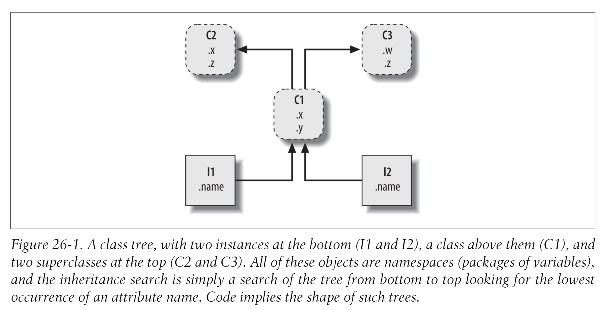
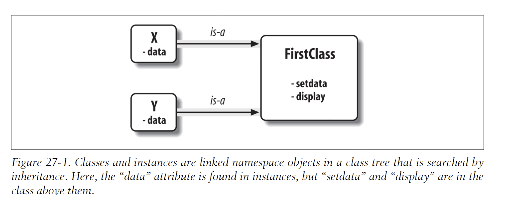

We usually call classes higher in the tree (like C2 and C3) superclasses; classes lower in the tree (like C1) are known as subclasses. These terms refer to both relative tree positions and roles. *Superclasses provide behavior shared by all their subclasses*, but because the search proceeds from the bottom up, subclasses may override behavior defined in their superclasses by redefining superclass names lower in the tree



--- 

> Note
- Each class statement generates a new class object. 
- Each time a class is called, it generates a new instance object. 
- Instances are automatically linked to the classes from which they are created. 
- Classes are automatically linked to their superclasses according to the way we list them in parentheses in a class header line; the left-to-right order there gives the order in the tree.

# `__init__`

> The `__init__` method is known as the constructor because of when it is run. 

If it’s coded or inherited, Python automatically calls a method named `__init__` each time an instance is generated from a class. The new instance is passed in to the self argument of `__init__` as usual, and any values listed in parentheses in the class call go to arguments two and beyond. The effect here is to initialize instances when they are made, without requiring extra method calls. 

It’s the most commonly used representative of a larger class of methods called operator over- loading methods, which we’ll discuss in more detail in the chapters that follow. Such methods are inherited in class trees as usual and have double underscores at the start and end of their names to make them distinct. Python runs them automatically when instances that support them appear in the corresponding operations, and they are mostly an alternative to using simple method calls. They’re also optional: if omitted, the operations are not supported. If no `__init__` is present, class calls return an empty instance, without initializing it.

# Classes
Classes Serve as instance factories. Their attributes provide behavior—data and functions —that is inherited by all the instances generated from them (e.g., a function to compute an employee’s salary from pay and hours).

> This is another difference between classes and modules : we only ever have one instance of a given module in memory (that’s why we have to reload a module to get its new code), but with classes, we can make as many instances as we need.

### Class Objects Provide Default Behavior 
When we run a class statement, we get a class object. Here’s a rundown of the main properties of Python classes: 

1. **The class statement creates a class object and assigns it a name**. 
	- Just like the function `def` statement, the Python class statement is an executable statement. When reached and run, it generates a new class object and assigns it to the name in the class header. 
	- Also, like `def`s, class statements typically run when the files they are coded in are first imported. 
2. **Assignments inside class statements make class attributes**. 
	- Just like in [[pages/python module|module]] files, top-level assignments within a class statement (not nested in a def) generate attributes in a class object. 
	- Technically, the class statement defines a local scope that morphs into the attribute namespace of the class object, just like a module’s global scope. 
	- After running a class statement, class attributes are accessed by name qualification: object.name. 
3. **Class attributes provide object state and behavior**
	- Attributes of a class object record state information and behavior to be shared by all instances created from the class; function def statements nested inside a class generate methods, which process instances.

```python

class FirstClass:
    """Defines class object"""

    def setData(self, value):
        self.data = value

    def display(self):
        return self.data
```



### super()

The super() function is a built-in function that can be called inside the derived class and gives access to the methods and variables of the parent classes or sibling classes. Sibling classes are the classes that share the same parent class. When you call the super() function, you get an object that represents the parent class in return.

The super() function plays an important role in multiple inheritance and helps drive the flow of the code execution. It helps in managing or determining the control of from where I can draw the values of my desired functions and variables.

If you change anything inside the parent class, there is a direct retrieval of changes inside the derived class. This is mainly used in places where you need to initialize the functionalities present inside the parent class in the child class as well. You can then add additional code in the child class.