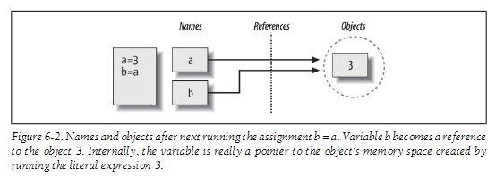
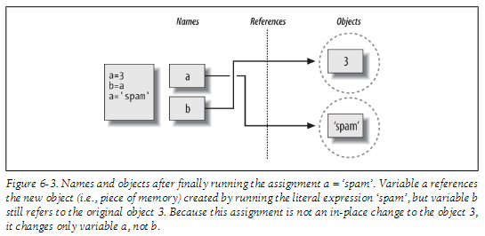

This scenario in Python with multiple names referencing the same object is usually called a shared reference (and sometimes just a shared object).

Unlike in some languages, in Python variables are always pointers to objects, not labels of changeable memory areas. Setting a variable to a new value does not alter the original object, but rather causes the variable to reference an entirely different object. The net effect is that assignment to a variable itself can impact only the single variable being assigned. 

---
#### Example 
```bash
>>> a = 3 
>>> b = a
>>> a = 'spam'
```



Typing these two statements generates the scene captured in Figure 6-2. The second command causes Python to create the variable b; the variable a is being used and not assigned here, so it is replaced with the object it references (3), and b is made to reference that object. The net effect is that the variables a and b wind up referencing the same object (that is, pointing to the same chunk of memory)

 Note that the names a and b are not linked to each other directly when this happens; in fact, there is no way to ever link a variable to another variable in Python. Rather, both variables point to the same object via their references
 
As with all Python assignments, this statement simply makes a new object to represent the string value 'spam' and sets a to reference this new object. It does not change the value of b; b still references the original object, the integer 3



#### Shared References and In-Place Changes
There are objects and operations that perform in-place object changes : Python’s mutable types, including lists, dictionaries, and sets. For instance, an assignment to an offset in a list actually changes the list object itself in place, rather than generating a brand-new list object

```bash
>>> L1 = [2, 3, 4] # A mutable object 
>>> L2 = L1 # Make a reference to the same object 
>>> L1[0] = 24 # An in-place change 

>>> L1 # L1 is different 
[24, 3, 4] 
>>> L2 # But so is L2! 
[24, 3, 4]
```

> [!NOTE] 
This behavior only occurs for mutable objects that support in-place changes