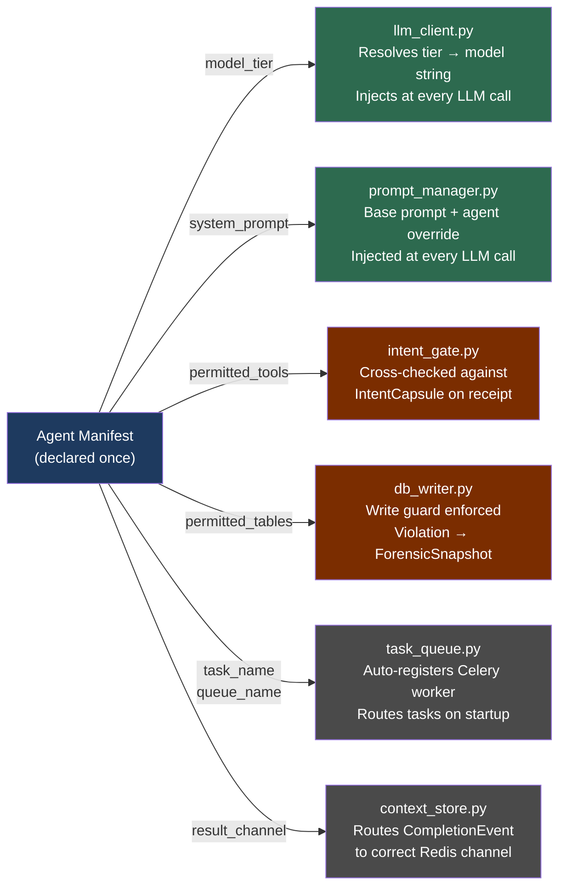
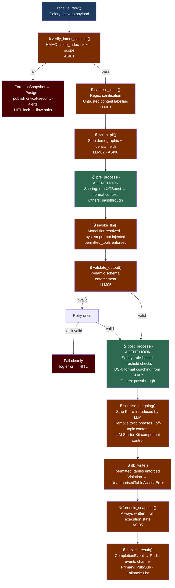
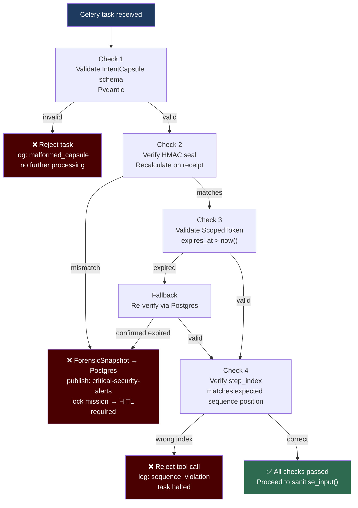
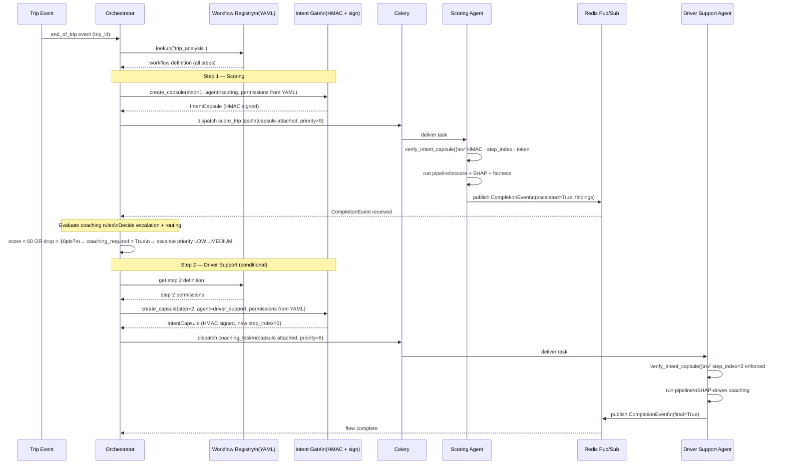
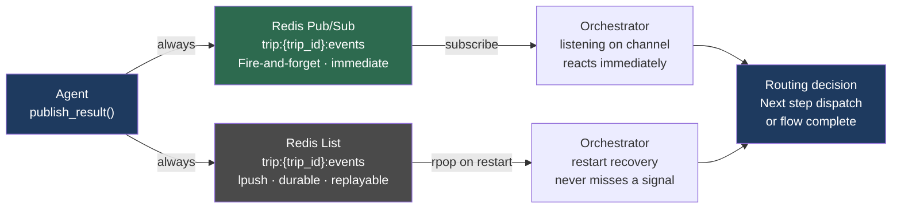

# TraceData — Common Module

**`common/` — The Agent Platform**

SWE5008 Capstone | March 2026

---

## 1. Purpose

The `common/` package is the shared infrastructure platform for all TraceData agents. It exists so that every agent author (Orchestrator, Safety, Scoring, Sentiment, Driver Support) writes only business logic — and receives infrastructure, LLM management, security enforcement, and observability for free.

**What agent authors write:**

- Agent Manifest (one config block)
- `get_system_prompt()` — domain-specific instructions
- `pre_process()` — domain-specific input transformation
- `post_process()` — domain-specific output transformation

**What `common/` handles automatically:**

- Intent Gate security pipeline (HMAC, step_index, token scope)
- Input sanitisation and PII scrubbing (incoming)
- Output sanitisation — strips toxic phrases, PII re-introduced by LLM, off-topic content (outgoing)
- LLM client lifecycle (model tier resolution, retries)
- Celery worker registration and task lifecycle
- Redis read/write (agents never import Redis directly)
- Postgres writes (agents never import SQLAlchemy directly)
- Pydantic output validation
- Forensic snapshots on security failures
- Structured audit logging
- LLM cost monitoring

---

## 2. Package Structure

```
common/
  agent/
    base_agent.py           ← BaseAgent class — the secured LangGraph pipeline
    llm_client.py           ← Model tier resolution + LLM call wrapper
    prompt_manager.py       ← Base system prompt + per-agent override slot
    output_validator.py     ← Pydantic schemas, LLM05 output enforcement

  infra/
    intent_gate.py          ← HMAC verify, IntentCapsule parsing, step_index (ASI01)
    context_store.py        ← Redis get/set abstraction — agents never see Redis
    task_queue.py           ← Celery worker registration + task lifecycle
    db_writer.py            ← Postgres writes — agents never see SQLAlchemy
    scoped_token.py         ← ScopedToken validation, TTL enforcement, key scope
    workflow_registry.py    ← Loads workflow YAML definitions, used by Orchestrator
    skill_registry.py       ← Maps agent capabilities to OWASP controls (machine-readable)

  observability/
    logger.py               ← Structured JSON logger, auto-injects agent/trip/step context
    tracer.py               ← LangGraph step timing
    cost_monitor.py         ← Token usage per LLM call, per agent, per trip

  tests/
    deepeval/
      test_scoring_agent.py    ← Answer relevancy, faithfulness, hallucination rate
      test_safety_agent.py
      test_driver_support.py
      conftest.py              ← Shared fixtures, model under test config
    promptfoo/
      promptfooconfig.yaml     ← Prompt quality tests across model versions
      prompts/                 ← Prompt templates under test
```

> **Note on `tests/`**: DeepEval and Promptfoo are confirmed assessment artefacts based on the course reference repos (`darryl1975/llmapp06`, `sree-r-one/swe5008-idas-llmapp05`). These are graded deliverables. See Section 17 for the full evaluation strategy.

---

## 3. Agent Manifest

Every agent declares a static manifest block — the single source of truth for its identity, permissions, and wiring. `BaseAgent` reads this manifest and enforces it automatically.

```python
class ScoringAgent(BaseAgent):

    # Identity
    agent_id        = "scoring_agent"
    model_tier      = "fast"              # "fast" | "balanced" | "powerful"

    # LLM
    system_prompt   = "You are a behaviour scoring interpreter..."

    # Security — what this agent may call
    permitted_tools = ["redis_read", "redis_write", "llm_call"]

    # Security — what tables this agent may touch
    permitted_tables = {
        "read":  ["trips", "telemetry_events"],
        "write": ["trip_scores", "fairness_audit_log"]
    }

    # Celery + Redis wiring
    task_name        = "tracedata.scoring.score_trip"
    queue_name       = "scoring_queue"
    result_channel   = "trip:{trip_id}:events"
```

| Manifest Field     | Enforced By         | Where                                           |
| ------------------ | ------------------- | ----------------------------------------------- |
| `model_tier`       | `llm_client.py`     | Resolved to actual model string at LLM call     |
| `system_prompt`    | `prompt_manager.py` | Injected at every LLM call                      |
| `permitted_tools`  | `intent_gate.py`    | Cross-checked against IntentCapsule on receipt  |
| `permitted_tables` | `db_writer.py`      | Write outside this list → exception + alert     |
| `task_name`        | `task_queue.py`     | Auto-registers Celery worker on startup         |
| `queue_name`       | `task_queue.py`     | Routes Celery task to correct queue             |
| `result_channel`   | `context_store.py`  | Routes CompletionEvent to correct Redis channel |



---

## 4. Model Tier Config

Tier resolution is defined in environment config — not in agent code. Changing models fleet-wide is a config change, not a code change. Agents in development always run on `fast` to control cost.

| Tier       | Default Model       | Agents                                  |
| ---------- | ------------------- | --------------------------------------- |
| `fast`     | `claude-haiku-4-5`  | Scoring (LLM interpretation), Sentiment |
| `balanced` | `claude-sonnet-4-6` | Safety, Driver Support                  |
| `powerful` | `claude-opus-4-6`   | Orchestrator                            |

Environment variable format:

```
MODEL_TIER_FAST=claude-haiku-4-5-20251001
MODEL_TIER_BALANCED=claude-sonnet-4-6
MODEL_TIER_POWERFUL=claude-opus-4-6
```

In `docker-compose.yml` for development:

```yaml
environment:
  MODEL_TIER_FAST: claude-haiku-4-5-20251001
  MODEL_TIER_BALANCED: claude-haiku-4-5-20251001 # override — all on fast in dev
  MODEL_TIER_POWERFUL: claude-haiku-4-5-20251001
```

---

## 5. Secured LangGraph Pipeline

The BaseAgent executes a fixed pipeline for every task. Steps marked `LOCKED` are mandatory and cannot be skipped, reordered, or overridden by subclasses. Agents only implement `pre_process()` and `post_process()`.



### Hook Responsibilities by Agent

| Agent          | `pre_process()`                     | `post_process()`                        |
| -------------- | ----------------------------------- | --------------------------------------- |
| Scoring        | Run XGBoost → format as LLM context | Passthrough                             |
| Safety         | Passthrough                         | Apply rule-based threshold checks       |
| Driver Support | Passthrough                         | Format coaching tips from SHAP features |
| Sentiment      | Passthrough                         | Confidence threshold check              |
| Orchestrator   | Passthrough                         | Routing decision, capsule issuance      |

---

## 6. IntentCapsule

Issued by the Orchestrator for every agent dispatch. Cryptographically sealed. Contains the complete authorisation for one agent execution — no more, no less.

```python
@dataclass
class IntentCapsule:
    trip_id:          str
    agent:            str
    priority:         int
    step_index:       int              # position in workflow sequence
    issued_by:        str              # always "orchestrator"
    allowed_inputs:   list[str]        # Redis keys agent may read
    expected_outputs: list[str]        # Redis keys agent may write
    permitted_tools:  list[str]        # tool calls agent may make
    ttl:              int              # seconds before capsule expires
    hmac_seal:        str              # HMAC_SHA256(secret, trip_id+agent+whitelist+step_index)
    token:            ScopedToken
```

```python
@dataclass
class ScopedToken:
    token_id:   str
    agent:      str
    expires_at: str                    # ISO8601 — short-lived, trip-bound
    read_keys:  list[str]              # exact Redis keys this agent may read
    write_keys: list[str]              # exact Redis keys this agent may write
    # Note: demographic_group NEVER appears in read_keys — Fairness Through Unawareness
```

### HMAC Seal

```
HMAC_SHA256(SHARED_SECRET, trip_id + agent + permitted_tools + step_index)
```

Recalculated on receipt. Any modification of the capsule — by the agent, a Redis-side actor, or a network attacker — results in immediate HMAC mismatch and task termination.

The `SHARED_SECRET` is an environment variable present in the Orchestrator container and all agent containers. It is never written to Redis, Postgres, or any log.

---

## 7. Intent Gate — Verification Sequence

Runs automatically in `verify_intent_capsule()` before any agent logic executes. All four checks must pass. First failure terminates the task immediately.

```
Check 1 — Schema Valid
  Pydantic validates IntentCapsule structure
  Fail → reject task, log malformed_capsule

Check 2 — HMAC Matches
  Recalculate HMAC on receipt, compare to capsule.hmac_seal
  Fail → ForensicSnapshot → Postgres
         publish to critical-security-alerts channel
         lock mission → HITL Fleet Manager override required

Check 3 — Token Not Expired
  capsule.token.expires_at > now()
  Fail → fallback to Postgres re-verification
         if Postgres confirms expired → same as HMAC failure

Check 4 — Step Index Correct
  capsule.step_index matches expected sequence position for this agent
  Fail → reject tool call, log sequence_violation
```

On any failure:

```python
ForensicSnapshot(
    capsule_snapshot   = <exact capsule JSONB>,
    agent_state        = <agent memory at violation>,
    offending_container= <container ID>,
    violation_type     = "hmac_mismatch" | "token_expired" | "sequence_violation" | "schema_invalid",
    timestamp          = <ISO8601>
)
# Written to: task_execution_logs (Postgres)
# Published to: critical-security-alerts (Redis channel)
# Result: no Redis writes, no Postgres writes, no LLM calls
```



---

## 8. Workflow Registry

The Orchestrator does not construct capsule contents dynamically. It reads from a pre-defined workflow registry — one YAML file per workflow. This is the policy layer. The capsule is the runtime enforcement of that policy.

```
common/
  infra/
    workflows/
      trip_analysis.yaml
      safety_alert.yaml
      driver_coaching.yaml
      sentiment_check.yaml
```

### Example: `trip_analysis.yaml`

```yaml
workflow_id: "trip_analysis"

steps:
  - step_index: 1
    agent: "scoring_agent"
    queue: "scoring_queue"
    priority: 9
    permitted_tools: ["redis_read", "redis_write", "llm_call"]
    allowed_inputs: ["trip:{trip_id}:context", "trip:{trip_id}:smoothness_logs"]
    expected_outputs: ["trip:{trip_id}:scoring_output"]
    permitted_tables:
      read: ["trips", "telemetry_events"]
      write: ["trip_scores", "fairness_audit_log"]
    ttl_seconds: 3600

  - step_index: 2
    agent: "driver_support_agent"
    queue: "driver_support_queue"
    priority: 6
    permitted_tools: ["redis_read", "redis_write", "llm_call"]
    allowed_inputs: ["trip:{trip_id}:context", "trip:{trip_id}:scoring_output"]
    expected_outputs: ["trip:{trip_id}:driver_support_output"]
    permitted_tables:
      read: ["trips", "trip_scores"]
      write: ["coaching_logs"]
    ttl_seconds: 600
    condition: "coaching_required" # only dispatched if Orchestrator evaluates true
```

### How Orchestrator uses the registry at runtime

```
New trip event arrives
  → Orchestrator looks up workflow: "trip_analysis"
  → Step 1:
      reads step definition
      creates IntentCapsule with exactly those permissions
      signs HMAC
      dispatches Celery task to scoring_agent
  → Waits on Redis Pub/Sub for CompletionEvent
  → Evaluates routing condition (coaching_required)
  → Step 2 (if condition met):
      same — reads step 2, creates new capsule with new step_index
      dispatches to driver_support_agent
```



---

## 9. CompletionEvent

Standard structure published by every agent on task completion. Agents never construct this directly — `publish_result()` in `BaseAgent` builds it from the agent's return value.

```python
@dataclass
class CompletionEvent:
    trip_id:    str
    agent:      str
    status:     str          # "done" | "error" | "escalated"
    priority:   int          # current priority at time of completion
    action_sla: str          # "1_week" | "3_days" | "same_day" | "immediate"
    escalated:  bool         # True if agent found reason to flag for re-evaluation
    findings:   dict         # agent-specific output summary (not full payload)
    final:      bool         # True = flow complete, False = more steps pending
```

Published to:

- **Primary:** Redis Pub/Sub `trip:{trip_id}:events` (fire-and-forget, immediate)
- **Fallback:** Redis List `trip:{trip_id}:events` via `lpush` (durable, replayable)



> **Note on escalation:** Agents set `escalated=True` when findings warrant re-evaluation (e.g., score below threshold). The **Orchestrator decides** what to do with that signal — priority escalation happens in Orchestrator routing logic, not in the agent. Agents signal findings; they do not change priority directly.

---

## 10. Audit Trail

Every step in the pipeline emits a structured audit event automatically. Agents never call this — it is wired into every `LOCKED` step in `BaseAgent`.

### Audit Event Structure

```python
@dataclass
class AuditEvent:
    agent_id:        str
    trip_id:         str
    driver_id:       str          # always anonymised token, never real ID
    step:            str          # "capsule_verify" | "pii_scrub" | "llm_invoke" |
                                  # "output_validate" | "db_write" | "publish"
    step_index:      int          # from IntentCapsule
    status:          str          # "ok" | "fail" | "escalated"
    model_used:      str | None   # for llm_invoke steps
    tokens_used:     int | None   # for llm_invoke steps (cost tracking)
    table_accessed:  str | None   # for db_write steps
    redis_key:       str | None   # for redis read/write steps
    duration_ms:     int          # step execution time
    timestamp:       str          # ISO8601
```

All audit events write to a single `agent_audit_log` table in Postgres, shared across all agents, filtered by `agent_id`. This is the primary evidence artifact for:

- IMDA Model AI Governance Framework (MGF) for Agentic AI — Dimension 1 (traceability) and Dimension 3 (technical controls)
- AI Verify process check questionnaire — principle: accountability and auditability
- The user-facing transparency report for fleet managers and drivers is generated from this table — it is the data source for the plain-English "What TraceData Did" document required by MGF Dimension 4

The `agent_audit_log` schema is structured to be AI Verify compatible — field names and data types align with AI Verify's `common/schemas/` test result format so the table can be consumed directly by the AI Verify test engine without transformation.

---

## 11. Infra Abstractions — Agent-Visible API

Agents interact with infrastructure through semantic methods only. They never import Redis, SQLAlchemy, or Celery directly.

### `context_store` (Redis)

```python
from common.infra.context_store import context_store

# Read
context = context_store.get(f"trip:{trip_id}:context")

# Write
context_store.set(f"trip:{trip_id}:scoring_output", payload, ttl=3600)

# Publish CompletionEvent
context_store.publish(f"trip:{trip_id}:events", completion_event)
```

### `db_writer` (Postgres)

```python
from common.infra.db_writer import db_writer

# Write — table checked against agent's permitted_tables
db_writer.insert("trip_scores", scoring_result)

# Update
db_writer.update("trips", {"status": "coaching_pending"}, where={"trip_id": trip_id})
```

Any write to a table not in the agent's `permitted_tables` raises `UnauthorisedTableAccessError`, logs the violation, and triggers a ForensicSnapshot. The agent does not catch this — it propagates up and halts execution.

### `task_queue` (Celery)

Agents do not call `task_queue` directly. `BaseAgent.__init__` registers the Celery worker automatically using `task_name` and `queue_name` from the manifest. Agents simply run — task routing is invisible.

---

## 12. Postgres Tables Owned by `common/`

These tables are created and managed by the common module. They are cross-cutting infrastructure, not owned by any individual agent.

| Table                 | Owner     | Purpose                                |
| --------------------- | --------- | -------------------------------------- |
| `agent_audit_log`     | `common/` | All audit events from all agents       |
| `task_execution_logs` | `common/` | ForensicSnapshots on security failures |

Agent-specific tables (`trip_scores`, `coaching_logs`, etc.) are owned by their respective agent's migration files.

---

## 13. Monorepo Import Pattern

Each agent imports from `common/` using the repo root. No packaging required.

```python
# In any agent
from common.agent.base_agent import BaseAgent
from common.infra.context_store import context_store
from common.infra.db_writer import db_writer
```

In `docker-compose.yml`, the repo root is mounted into every container, and services are wired with proper health checks and Redis DB separation — adapted from the EchoChamber reference pattern:

```yaml
services:
  postgres:
    image: ankane/pgvector:latest
    healthcheck:
      test: ["CMD-SHELL", "pg_isready -U tracedata"]
      interval: 10s
      timeout: 5s
      retries: 5

  redis:
    image: redis:7-alpine
    command: redis-server --appendonly yes --maxmemory 256mb --maxmemory-policy allkeys-lru
    healthcheck:
      test: ["CMD", "redis-cli", "ping"]
      interval: 10s

  scoring_agent:
    build: ./scoring_agent
    volumes:
      - .:/app # repo root → /app, so /app/common always visible
    working_dir: /app
    environment:
      - REDIS_CACHE_URL=redis://redis:6379/0 # DB0 — context store, pub/sub
      - CELERY_BROKER_URL=redis://redis:6379/1 # DB1 — Celery broker (isolated)
      - MODEL_TIER_FAST=claude-haiku-4-5-20251001
    depends_on:
      postgres:
        condition: service_healthy
      redis:
        condition: service_healthy

  # Celery worker — executes agent tasks
  celery_worker:
    build: ./scoring_agent
    volumes:
      - .:/app
    working_dir: /app
    command: celery -A common.infra.task_queue worker --loglevel=info --concurrency=2
    environment:
      - CELERY_BROKER_URL=redis://redis:6379/1
    depends_on:
      redis:
        condition: service_healthy
```

**Key patterns adapted from `project_ec_analyst`:**

- Redis DB0 / DB1 split — broker traffic on DB1 never pollutes context store reads on DB0.
- `--appendonly yes` ensures Redis survives container restarts with data intact.
- All `depends_on` use `condition: service_healthy`, not just service name — prevents agents starting before infra is ready.

> **Note on Celery Beat:** A scheduled beat service was considered for fleet-level AIF360 batch audits (nightly demographic parity across 30 days of trip data). Excluded from current scope — meaningful batch fairness requires real fleet data that won't exist until post-Sprint 4. Documented as a Phase 8 item.

---

## 14. OWASP Coverage Map

| Threat                      | Standard | `common/` Component                  | How                                                                              |
| --------------------------- | -------- | ------------------------------------ | -------------------------------------------------------------------------------- |
| Prompt Injection            | LLM01    | `base_agent.sanitise_input()`        | Regex sanitiser + untrusted content labelling                                    |
| Sensitive Info Disclosure   | LLM02    | `base_agent.scrub_pii()`             | Strip demographic + identity fields before LLM                                   |
| Supply Chain                | LLM03    | CI/CD — Trivy scanner                | Container image scanning on every build (`.trivyignore` for accepted exceptions) |
| Improper Output Handling    | LLM05    | `output_validator.py`                | Pydantic validation on every LLM response                                        |
| Excessive Agency            | LLM06    | `scoped_token.py`                    | `permitted_tools` whitelist enforced at invocation                               |
| Agent Goal Hijacking        | ASI01    | `intent_gate.py`                     | HMAC-sealed IntentCapsule + step_index                                           |
| Tool Misuse                 | ASI02    | `intent_gate.py` + `scoped_token.py` | Tool calls cross-checked against capsule whitelist                               |
| Identity/Privilege Abuse    | ASI03    | `scoped_token.py`                    | Short-lived TTL-bound tokens, trip-scoped                                        |
| Resource Overconsumption    | ASI04    | `task_queue.py`                      | Celery task queue SLA limits                                                     |
| Repudiation                 | ASI05    | `db_writer.py` + `logger.py`         | ForensicSnapshot + agent_audit_log always written                                |
| Sensitive Data in Pipelines | ASI06    | `base_agent.scrub_pii()`             | Demographic data never in TripContext                                            |
| Cascading Failures          | ASI08    | `intent_gate.py`                     | step_index circuit breaker + null score halt                                     |

**Skill Registry (`skill_registry.py`)** — adapted from the `Anthropic-Cybersecurity-Skills` mapping pattern. Each agent's `permitted_tools` is registered against its OWASP control coverage at startup. This makes security coverage machine-readable and auditable rather than only documented:

```python
SKILL_REGISTRY = {
    "scoring_agent": {
        "permitted_tools": ["redis_read", "redis_write", "llm_call"],
        "owasp_controls":  ["LLM01", "LLM02", "LLM05", "ASI01", "ASI03"],
        "permitted_tables": {"read": ["trips"], "write": ["trip_scores"]}
    }
}
```

At startup, `BaseAgent.__init__` validates its manifest against the registry. Any mismatch raises `AgentManifestMismatchError` — catches configuration drift before a task runs.

---

## 15. Sprint Delivery Plan for `common/`

| Sprint   | Deliverable                                                                                                              | Notes                                                                                    |
| -------- | ------------------------------------------------------------------------------------------------------------------------ | ---------------------------------------------------------------------------------------- |
| Sprint 1 | Package skeleton, `BaseAgent` with hooks, `IntentCapsule` dataclass, `context_store` stub                                | Unblocks all agent stubs — critical path                                                 |
| Sprint 1 | `task_queue.py` Celery worker registration, `logger.py` structured JSON                                                  | Container handshakes working                                                             |
| Sprint 2 | Input filter unit tests in `common/tests/` — `sanitise_input()` and `sanitise_outgoing()` against known injection corpus | **MGF Dimension 3 baseline testing requirement** — LLM Starter Kit Risk 5 component test |
| Sprint 2 | `intent_gate.py` — HMAC logged but not enforced, `db_writer.py` wired                                                    | AWS deployment milestone                                                                 |
| Sprint 3 | Full HMAC enforcement, `output_validator.py` Pydantic, `cost_monitor.py`                                                 | XGBoost + SHAP swap sprint                                                               |
| Sprint 3 | DeepEval test scaffolding in `common/tests/deepeval/` — answer relevancy + faithfulness + hallucination                  | **MGF Dimension 3 baseline testing** — graded artefact                                   |
| Sprint 3 | AI Verify fairness tests on XGBoost model (protected attributes labelled in training data)                               | **AI Verify technical test report** — citable evidence                                   |
| Sprint 3 | Project Moonshot benchmarks — agents exposed as FastAPI endpoints                                                        | **Moonshot evaluation report** — strongest responsible AI evidence                       |
| Sprint 4 | `workflow_registry.py` YAML loading, full `agent_audit_log` wiring, AI Verify schema alignment                           | Hardening sprint                                                                         |
| Sprint 4 | Promptfoo prompt quality tests, Trivy scan in CI/CD, `skill_registry.py` validation                                      | Graded artefacts — rubric evidence                                                       |
| Sprint 4 | AI Verify process check questionnaire completed (all 11 principles mapped to TraceData docs)                             | Can be done without code — map each answer to a specific document                        |

> **MGF Dimension 3 note:** The `common/tests/` structure is TraceData's formal baseline testing plan. Sprint 2 unit tests (input filters) + Sprint 3 DeepEval + Sprint 3 AI Verify + Sprint 3 Moonshot together constitute the pre-deployment testing evidence required by the MGF for Agentic AI.

---

## 17. LLM Evaluation Strategy

Based on the course reference repos (`darryl1975/llmapp06`, `sree-r-one/swe5008-idas-llmapp05`), two evaluation frameworks are expected as graded deliverables.

### DeepEval — Runtime Quality Metrics

DeepEval tests LLM output quality against defined criteria. Each agent has its own test file under `common/tests/deepeval/`.

```python
# common/tests/deepeval/test_scoring_agent.py

from deepeval import assert_test
from deepeval.metrics import AnswerRelevancyMetric, FaithfulnessMetric, HallucinationMetric
from deepeval.test_case import LLMTestCase

def test_scoring_explanation_relevancy():
    """SHAP explanation must be relevant to the score and driving events."""
    test_case = LLMTestCase(
        input="Trip: 8 harsh braking events, score 54.2",
        actual_output=scoring_agent.explain(trip_context),
        expected_output="Explanation references harsh braking as primary factor"
    )
    assert_test(test_case, [
        AnswerRelevancyMetric(threshold=0.8),
        FaithfulnessMetric(threshold=0.9),     # output grounded in SHAP values
        HallucinationMetric(threshold=0.1),    # no invented driving events
    ])
```

| Agent          | Key Metric              | Why                                                             |
| -------------- | ----------------------- | --------------------------------------------------------------- |
| Scoring        | `FaithfulnessMetric`    | SHAP explanation must be grounded in model output, not invented |
| Safety         | `HallucinationMetric`   | Safety alerts must not fabricate events                         |
| Driver Support | `AnswerRelevancyMetric` | Coaching tips must address the actual SHAP features             |
| Sentiment      | `AnswerRelevancyMetric` | Sentiment must reflect the actual dispute text                  |

### Promptfoo — Prompt Quality and Regression Testing

Promptfoo tests prompt templates across model versions and configurations. Catches prompt regressions when models are swapped (e.g., fast → balanced tier upgrade).

```yaml
# common/tests/promptfoo/promptfooconfig.yaml

providers:
  - id: anthropic:messages:claude-haiku-4-5-20251001
    label: fast-tier
  - id: anthropic:messages:claude-sonnet-4-6
    label: balanced-tier

prompts:
  - file://prompts/scoring_system_prompt.txt
  - file://prompts/safety_system_prompt.txt

tests:
  - description: "Scoring explanation mentions top SHAP feature"
    vars:
      trip_context: "harsh_brake_count: 0.34, speed_std_dev: 0.21"
    assert:
      - type: contains
        value: "harsh braking"
      - type: not-contains
        value: "I cannot determine" # hallucination guard

  - description: "Safety agent does not fabricate events"
    vars:
      trip_context: "no_speeding_events: true"
    assert:
      - type: not-contains
        value: "speeding"
```

### Trivy — Container Vulnerability Scanning (CI/CD)

Adapted from `.trivyignore` pattern in both `llmapp06` and `swe5008-idas-llmapp05`. Added to GitHub Actions on every build — covers LLM03 (Supply Chain).

```yaml
# .github/workflows/ci.yml (addition)
- name: Trivy container scan
  uses: aquasecurity/trivy-action@master
  with:
    image-ref: tracedata/scoring_agent:${{ github.sha }}
    format: sarif
    severity: HIGH,CRITICAL
    ignore-unfixed: true
    trivyignores: .trivyignore
```

```
# .trivyignore — accepted exceptions with justification
CVE-XXXX-XXXX  # pinned dependency, no fix available, mitigated by network isolation
```

### How BaseAgent exposes evaluation hooks

DeepEval and Promptfoo need to call the agent in isolation without a live Celery task. `BaseAgent` exposes a `evaluate(input)` method that runs the full pipeline (including security gates) but skips the Celery receive/publish steps — safe for offline testing:

```python
class BaseAgent:
    def evaluate(self, input: dict) -> dict:
        """Offline evaluation entry point for DeepEval/Promptfoo.
        Runs full pipeline except Celery receive and Redis publish.
        Intent Gate still enforced — tests must provide a valid capsule."""
        ...
```

### Moonshot — FastAPI Endpoint Wrapper

Project Moonshot connects to agents via HTTP endpoints. Each agent that requires Moonshot testing (Sentiment, Driver Support, Scoring) needs a thin FastAPI wrapper around `BaseAgent.evaluate()`. This lives in each agent's folder, not in `common/`:

```python
# sentiment_agent/moonshot_endpoint.py
from fastapi import FastAPI
from common.agent.base_agent import BaseAgent

app = FastAPI()
agent = SentimentAgent()

@app.post("/v1/predict")
async def predict(payload: dict):
    """Moonshot-compatible endpoint.
    Moonshot sends prompts here and evaluates the response."""
    result = agent.evaluate(payload)
    return {"response": result["llm_output"]}
```

Moonshot then connects to `http://localhost:8001/v1/predict` as the connector endpoint. This is how you run:

- Injection attack suite against the Sentiment Agent
- System prompt extraction tests against Driver Support
- Toxicity benchmarks against coaching output

### AI Verify — Training Data Format

For AI Verify fairness tests on the XGBoost model, the training data must be structured with protected attributes labelled separately from model features. These attributes are used only for post-hoc audit — they are never model inputs:

```python
# Structure required by AI Verify test engine
training_data = {
    "features": {
        "harsh_brake_count": [...],   # model features only
        "speed_std_dev":     [...],
        "jerk_mean":         [...],
        "smoothness_score":  [...],
        "trip_meter_km":     [...],
    },
    "protected_attributes": {         # for fairness audit only
        "route_type":  [...],         # urban | highway | mixed
        "age_group":   [...],         # age_18_25 | age_26_35 | etc.
        "shift_type":  [...],         # day_standard | night | etc.
    },
    "labels": [...]                   # actual behaviour scores
}
```

AI Verify will compute Demographic Parity Difference, Equal Opportunity Difference, and Disparate Impact Ratio automatically. Threshold: Disparate Impact Ratio >= 0.8 across all protected groups.

### Starter Kit Test Thresholds

Based on IMDA LLM Starter Kit (January 2026) — these are the pass/fail thresholds for TraceData's safety-critical domain:

| Risk                     | Metric                                     | Threshold | Rationale                        |
| ------------------------ | ------------------------------------------ | --------- | -------------------------------- |
| Hallucination            | Top SHAP feature addressed in coaching tip | >= 90%    | Coaching must be evidence-based  |
| Bias                     | Disparate impact ratio                     | >= 0.8    | AIF360 standard                  |
| Undesirable content      | False positive on "distressed" label       | <= 5%     | Prevent alert fatigue            |
| Data leakage             | PII in LLM output                          | 0%        | Zero tolerance — regulatory      |
| System prompt disclosure | Prompt content in output                   | 0%        | Zero tolerance — security        |
| Injection resistance     | Injections blocked                         | >= 95%    | High risk — driver safety advice |

---

## 16. What Each Agent Owner Needs to Know

You own your agent folder. You do not touch `common/`. Your only responsibilities are:

1. **Declare your manifest** — `agent_id`, `model_tier`, `system_prompt`, `permitted_tools`, `permitted_tables`, `task_name`, `queue_name`, `result_channel`
2. **Implement `pre_process(self, input)`** — return transformed input, or return input unchanged
3. **Implement `post_process(self, output)`** — return transformed output, or return output unchanged
4. **Implement `get_system_prompt(self)`** — return your domain-specific system prompt string

If you need to write to Postgres, declare the table in `permitted_tables`. If you need to read a Redis key, it must be in your IntentCapsule's `allowed_inputs` — ask Sree to add it to the workflow YAML.

You do not manage Redis connections, Celery workers, logging, or security checks. They are handled.
