# TraceData — Scoring Agent Specification

**Agent:** Scoring Agent  
**Owner:** Sree  
**Version:** 1.5  
**Sprint Status:** Sprint 2 → rule-based formula | Sprint 3 → XGBoost + SHAP + AIF360  
**Document Type:** Agent Specification  
**Related Documents:** A3 Input Data Architecture, FL-SCO-01 End-of-Trip Flow, Safety Agent Spec  
**Last Updated:** March 2026

---

## Quick Reference — Input / Output Contract

This section is the unambiguous contract for the Scoring Agent. Read this first. Everything else in this document explains how and why.

### INPUTS — What the Agent Reads

| #   | Redis Key                        | Type        | Written By                                                   | Contains                                                                    |
| --- | -------------------------------- | ----------- | ------------------------------------------------------------ | --------------------------------------------------------------------------- |
| I-1 | `trip:{trip_id}:context`         | String JSON | Orchestrator                                                 | Trip metadata, historical avg, peer group avg, start/end coords             |
| I-2 | `trip:{trip_id}:smoothness_logs` | Redis List  | Orchestrator (loaded from Postgres `events` table)           | One JSON per 10-min window — pre-computed stats from device                 |
| I-3 | `trip:{trip_id}:harsh_events`    | Redis List  | Orchestrator (merged from `events` + `safety_output` tables) | One JSON per harsh event — GPS + force values + **Safety Agent enrichment** |

The agent reads **only** these three keys. No other Redis keys. No Postgres queries. No S3 access during normal scoring.

**Note on I-3:** By the time `end_of_trip` fires, every harsh event in this trip has already been processed by the Safety Agent — guaranteed by the two-minute priority ceiling. The Orchestrator merges raw event data with Safety Agent context before writing to Redis. The Scoring Agent and Driver Support Agent both receive pre-enriched harsh event records.

### OUTPUTS — What the Agent Writes

| #   | Destination                                    | Type        | Contains                                                                 |
| --- | ---------------------------------------------- | ----------- | ------------------------------------------------------------------------ |
| O-1 | `trip:{trip_id}:scoring_output` (Redis)        | String JSON | trip_score, score_breakdown, coaching_flags, shap_values, fairness_flags |
| O-2 | `trip_scores` (Postgres)                       | Row         | Permanent record of score + SHAP + explanation                           |
| O-3 | `fairness_audit_log` (Postgres)                | Row         | Demographic parity check record                                          |
| O-4 | `driver_scores` (Postgres)                     | Upsert      | Updated 0–5 star driver rating                                           |
| O-5 | `trip:{trip_id}:events` (Redis Pub/Sub + List) | JSON        | CompletionEvent signalling Orchestrator                                  |

### The Two Outputs the Driver Sees

```
Trip Score:     0–100    How smooth was this trip?
Driver Rating:  0–5 ⭐   Rolling average of last 20 trip scores
```

### What the Agent Does NOT Do

```
❌ Does not query Postgres directly
❌ Does not read from S3 (S3 is for dispute resolution only)
❌ Does not see demographic data (not in ScopedToken)
❌ Does not use harsh event counts to reduce the trip score
❌ Does not produce coaching tips (that is Driver Support Agent's job)
❌ Does not run before end_of_trip is received
```

---

## 1. What This Agent Does

The Scoring Agent is the analytical engine of TraceData. It runs once per trip, after the driver or fleet manager marks the trip as complete. It answers two questions:

> **"How smooth was this driver's driving on this trip?"** → Trip Score (0–100)  
> **"Does this driver need coaching support?"** → Coaching Flag (yes/no + reason + location)

These are two separate outputs, deliberately kept apart. The score rewards positive behaviour. The coaching flag identifies drivers who need help — and precisely where they need it.

### Core Design Philosophy

```
Score with smoothness.     Flag with harsh events.     Keep them separate.
```

Harsh braking is sometimes the correct, safe action — avoiding an obstacle, responding to a cut-in, reacting to road conditions. Penalising it would create a perverse incentive: drivers protecting their score instead of driving safely. Therefore:

- **Trip score** is built entirely from smoothness signals — what the driver fully controls
- **Harsh events** are used only to raise a coaching flag — never to reduce the score
- **Driver rating** is the rolling average of trip scores over the last 20 trips, expressed as 0–5 stars
- **`smoothness_log` ML weight is -0.2** — explicitly a reward bonus in the EVENT_MATRIX, not a penalty

### Agent Position in the Full System

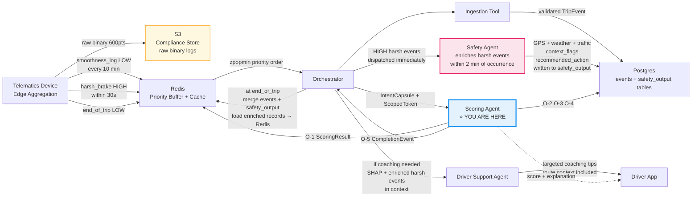

---

## 2. Two Device Streams — The Foundation

Before anything else, understand that the telematics device sends two completely separate streams. The Scoring Agent uses both, for completely different purposes.

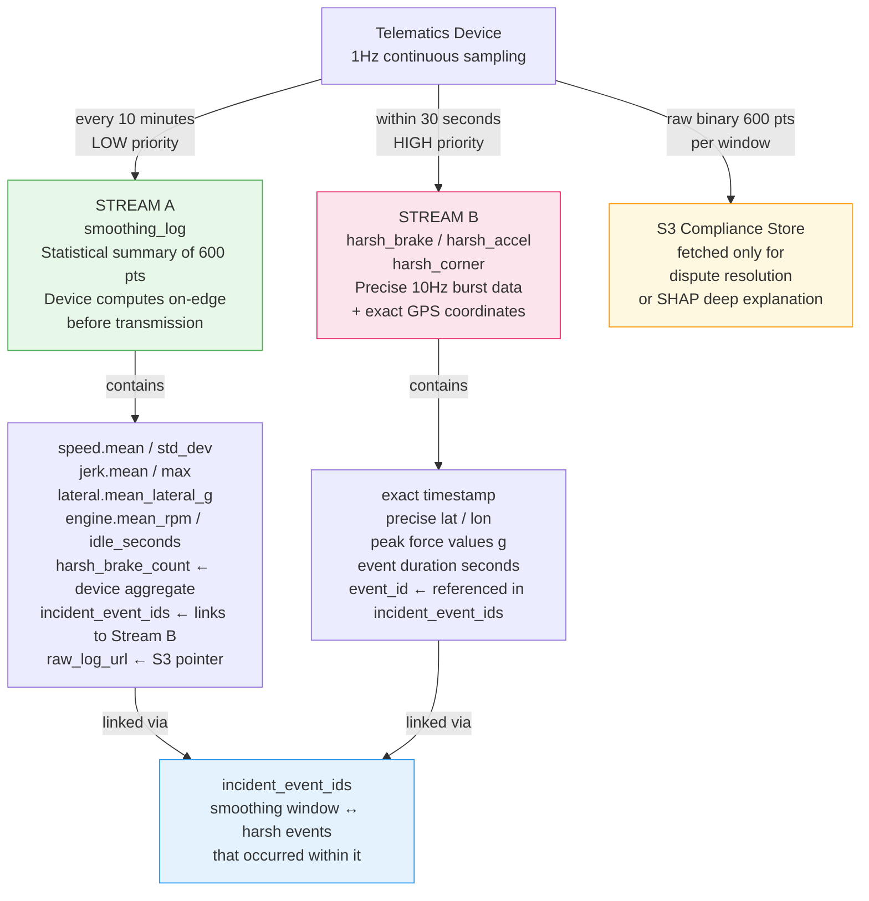

### What Each Stream Is Used For

|                 | Stream A — smoothness_log        | Stream B — harsh event           |
| --------------- | -------------------------------- | -------------------------------- |
| **Priority**    | LOW (score 9 in ZSet)            | HIGH (score 3 in ZSet)           |
| **Transmitted** | Every 10 minutes                 | Within 30 seconds of event       |
| **Data type**   | Pre-computed statistical summary | Precise 10Hz burst + GPS         |
| **Used for**    | Trip score — XGBoost input       | Coaching flag + coaching content |
| **Stored in**   | Postgres events table            | Postgres events table            |
| **Raw data**    | S3 binary (600 1Hz points)       | S3 binary (10Hz burst)           |
| **Redis key**   | `trip:{trip_id}:smoothness_logs` | `trip:{trip_id}:harsh_events`    |

### The `incident_event_ids` Link

Every smoothness_log window carries a list of event IDs for harsh events that occurred during that window:

```json
"incident_event_ids": ["EV-T12345-00042", "EV-T12345-00043"]
```

This cross-reference enables location-aware coaching. The smoothness_log tells you **how many** harsh events happened (aggregate count). The `incident_event_ids` gives you the full records — precise GPS, force values, duration — so the Driver Support Agent can say:

> _"Both your harsh braking events were within 500m of each other on AYE — this junction may have poor sight lines, not a habit to correct."_

---

## 3. Safety Agent Enrichment — Why It Matters

Every harsh event in this trip was already processed by the Safety Agent before the Scoring Agent ever runs. This is guaranteed by the two-minute priority ceiling. By the time `end_of_trip` fires, the enrichment is already sitting in Postgres.

### The Timing Guarantee

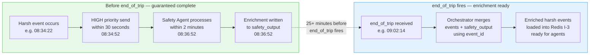

### What the Safety Agent Adds

The Safety Agent correlates each harsh event against three external data sources at the time of the event:

```
GPS coordinates  →  known hazard zone database
                    "this junction has 14 incidents in last 6 months"

Timestamp        →  traffic data API
                    "peak hour congestion — above-average brake frequency expected"

Timestamp        →  weather data API
                    "wet roads at time of event — reduced stopping distance"
```

This produces two enrichment fields per event written to the `safety_output` table:

```json
{
  "event_id": "EV-T12345-00042",
  "context_flags": {
    "known_hazard_zone": true,
    "peak_hour_traffic": true,
    "poor_visibility": false,
    "wet_road_conditions": false,
    "hazard_zone_name": "AYE-KM28 merge point",
    "hazard_zone_incidents_6m": 14
  },
  "recommended_action": "monitor",
  "safety_note": "Event occurred at known hazard zone during peak hour. Consistent with route conditions rather than driver habit.",
  "processed_at": "2026-03-07T08:36:47Z"
}
```

**Recommended action values:**

| Value      | Meaning                                 | Consequence                             |
| ---------- | --------------------------------------- | --------------------------------------- |
| `monitor`  | Isolated event, context explains it     | No coaching flag raised by Safety Agent |
| `coach`    | Pattern detected, coaching warranted    | Scoring Agent coaching flag reinforced  |
| `escalate` | Safety-critical, fleet manager must act | Orchestrator notified immediately       |

### How Orchestrator Merges at Cache Warming

```python
# Orchestrator cache warming — at end_of_trip

# Step A: raw harsh events from events table
raw_events = postgres.query("""
    SELECT * FROM events
    WHERE trip_id = %s
    AND event_type IN ('harsh_brake', 'harsh_accel', 'harsh_corner')
    ORDER BY timestamp ASC
""", trip_id)

# Step B: Safety Agent enrichment from safety_output table
# Correlation key: event_id
enrichment = postgres.query("""
    SELECT * FROM safety_output
    WHERE event_id = ANY(%s)
""", [e.event_id for e in raw_events])

enrichment_by_id = {e.event_id: e for e in enrichment}

# Step C: merge into one enriched record per event
enriched_events = []
for event in raw_events:
    record = {
        **event.to_dict(),
        "safety_context": enrichment_by_id.get(event.event_id, {})
    }
    enriched_events.append(record)

# Step D: write to Redis I-3
for record in enriched_events:
    redis.rpush(f"trip:{trip_id}:harsh_events", json.dumps(record))
```

The `event_id` is the correlation key that makes this work cleanly. It is stamped on the device at the moment of detection, travels through the entire pipeline unchanged, and appears in both the `events` table and the `safety_output` table.

### How Enrichment Changes Coaching

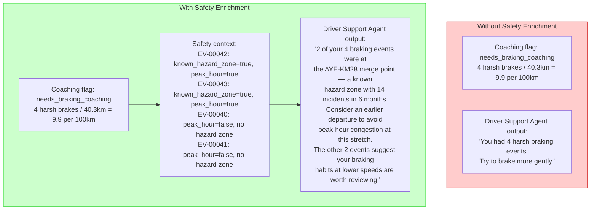

---

## 4. How Data Gets From Device to Agent — Full Pipeline

### The Complete Journey

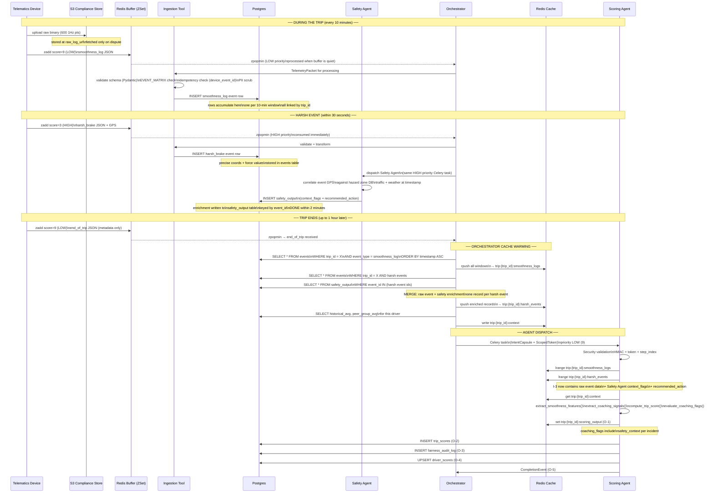

### Why Agents Never Query Postgres Directly

```
If agents query Postgres directly:
  → every agent needs DB credentials
  → connection pool pressure multiplies with agent count
  → no single point of control for what data enters the pipeline
  → harder to enforce Fairness Through Unawareness

Instead — Orchestrator is the only DB reader at trip start:
  → loads everything into Redis before dispatch
  → ScopedToken whitelists exactly which keys each agent may read
  → demographic data simply not loaded into Redis
  → one place to audit, one place to secure
```

---

## 4. Input Detail — What Each Key Contains

### I-1 — TripContext

**Redis Key:** `trip:{trip_id}:context`  
**Type:** String (JSON)  
**TTL:** 7200 seconds  
**Written by:** Orchestrator at cache warming step  
**Read by:** Scoring Agent (and all agents in this flow)

```json
{
  "trip_id": "TRIP-T12345-2026-03-07-08:00",
  "driver_id": "DRV-ANON-7829",
  "truck_id": "T12345",
  "priority": 9,
  "historical_avg_score": 71.2,
  "peer_group_avg": 68.4,
  "trip_summary": {
    "trip_start_time": "2026-03-07T08:00:00Z",
    "trip_end_time": "2026-03-07T09:02:14Z",
    "duration_minutes": 62,
    "distance_km": 40.3,
    "odometer_start_km": 180200.0,
    "odometer_end_km": 180240.3,
    "start_coords": { "lat": 1.3644, "lon": 103.9915 },
    "end_coords": { "lat": 1.3138, "lon": 103.764 },
    "window_count": 6
  }
}
```

**Fields used by Scoring Agent:**

| Field                           | Used For                                                               |
| ------------------------------- | ---------------------------------------------------------------------- |
| `driver_id`                     | Anonymised token — written to Postgres, never seen by model            |
| `historical_avg_score`          | Rule 2 trend check (delta from 3-trip rolling avg)                     |
| `peer_group_avg`                | Fairness normalisation — is this score an outlier for this peer group? |
| `trip_summary.distance_km`      | Denominator for per-100km harsh event normalisation                    |
| `trip_summary.duration_minutes` | Denominator for idle ratio calculation                                 |
| `trip_summary.window_count`     | Validation — confirms expected number of smoothness windows            |

**Fields NOT used by model (never in feature set):**

```
driver_id             → anonymised token, written to DB only
demographic_group     → not present in context by design
age_group             → not present in context by design
route_type            → not present in context by design
shift_type            → not present in context by design
```

---

### I-2 — Smoothness Logs

**Redis Key:** `trip:{trip_id}:smoothness_logs`  
**Type:** Redis List — one JSON entry per 10-minute window  
**TTL:** 7200 seconds  
**Written by:** Orchestrator (loaded from Postgres events table)  
**Read by:** Scoring Agent via `lrange 0 -1` (reads all entries)

**Critical:** The device computes all statistics from 600 raw 1Hz data points on-edge before transmission. The Scoring Agent receives pre-computed statistics — it never processes raw sensor readings.

```json
{
  "window_index": 3,
  "window_start": "2026-03-07T08:30:00Z",
  "window_end": "2026-03-07T08:40:00Z",
  "offset_seconds": 1800,
  "trip_meter_km": 29.4,
  "coords": {
    "start": { "lat": 1.3298, "lon": 103.8234 },
    "end": { "lat": 1.3201, "lon": 103.7912 }
  },
  "sample_count": 600,
  "window_seconds": 600,
  "speed": {
    "mean_kmh": 54.2,
    "std_dev": 18.6,
    "max_kmh": 88.0
  },
  "longitudinal": {
    "mean_accel_g": 0.07,
    "std_dev": 0.19,
    "max_decel_g": -0.51,
    "harsh_brake_count": 2,
    "harsh_accel_count": 1
  },
  "lateral": {
    "mean_lateral_g": 0.03,
    "max_lateral_g": 0.19,
    "harsh_corner_count": 0
  },
  "jerk": {
    "mean": 0.024,
    "max": 0.089,
    "std_dev": 0.019
  },
  "engine": {
    "mean_rpm": 1720,
    "idle_seconds": 42,
    "over_rev_count": 0,
    "over_rev_seconds": 0
  },
  "incident_event_ids": ["EV-T12345-00042", "EV-T12345-00043"],
  "raw_log_url": "s3://tracedata-sensors/T12345-batch-004.bin"
}
```

**Note on `harsh_brake_count` in this schema:**  
This is the device's aggregate count for this 10-minute window — computed on-device. The Scoring Agent does **not** use this field for scoring or coaching flags. It uses the dedicated harsh event records (I-3), which carry richer GPS and force data. The count here serves only as a cross-check.

**Note on `raw_log_url`:**  
Points to the S3 binary with all 600 raw data points. Never fetched during normal scoring. Fetched only for dispute resolution or deep SHAP explanation.

---

### I-3 — Harsh Events

**Redis Key:** `trip:{trip_id}:harsh_events`  
**Type:** Redis List — one JSON entry per harsh event  
**TTL:** 7200 seconds  
**Written by:** Orchestrator — merged from `events` table + `safety_output` table using `event_id` as correlation key  
**Source:** HIGH priority stream, transmitted within 30 seconds; Safety Agent enrichment written within 2 minutes

Each record is a merge of the raw event and the Safety Agent's enrichment:

```json
{
  "event_id": "EV-T12345-00042",
  "event_type": "harsh_brake",
  "timestamp": "2026-03-07T08:34:22Z",
  "offset_seconds": 2062,
  "trip_meter_km": 28.7,
  "location": { "lat": 1.3298, "lon": 103.8234 },
  "details": {
    "peak_decel_g": -0.71,
    "duration_seconds": 1.4,
    "speed_at_event_kmh": 67.2,
    "pre_event_speed_kmh": 71.0
  },
  "safety_context": {
    "context_flags": {
      "known_hazard_zone": true,
      "peak_hour_traffic": true,
      "poor_visibility": false,
      "wet_road_conditions": false,
      "hazard_zone_name": "AYE-KM28 merge point",
      "hazard_zone_incidents_6m": 14
    },
    "recommended_action": "monitor",
    "safety_note": "Event at known hazard zone during peak hour. Consistent with route conditions.",
    "processed_at": "2026-03-07T08:36:47Z"
  }
}
```

**If Safety Agent enrichment is not yet available** (rare edge case where Safety Agent processing is delayed):

```json
"safety_context": null
```

The Scoring Agent and coaching flag logic handle `null` safety_context gracefully — coaching flags are still raised based on per-100km rates alone. The enrichment adds context, it does not gate the coaching decision.

**How enrichment changes the coaching output:**

| Without enrichment                                          | With enrichment                                                                                                                                                                                                               |
| ----------------------------------------------------------- | ----------------------------------------------------------------------------------------------------------------------------------------------------------------------------------------------------------------------------- |
| "You had 4 harsh braking events. Try to brake more gently." | "2 of your 4 braking events were at AYE-KM28, a known hazard zone with 14 incidents this year. Consider earlier departure to avoid peak-hour congestion. Your other 2 events at lower speeds are worth reviewing separately." |

---

## 5. Feature Extraction

The Scoring Agent collapses all smoothness windows into one flat row of numbers for XGBoost, and separately extracts coaching signals from the harsh event records.

### Two Pipelines, One Pass

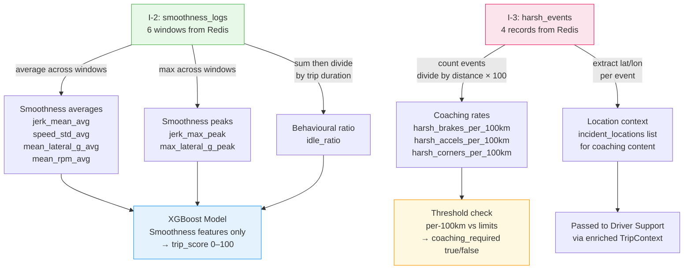

### Smoothness Feature Set (XGBoost inputs only)

```python
def extract_smoothness_features(windows: list[dict]) -> dict:
    """
    Input:  list of smoothness_log window dicts from Redis
    Output: one flat dict — one row for XGBoost
    All values are pre-computed by device. We aggregate across windows.
    """
    return {
        # ── Jerk: primary smoothness signal ──────────────────────────────
        # Low jerk = smooth, controlled motion
        # Device computed jerk = second derivative of velocity (m/s³)
        "jerk_mean_avg":      mean([w["jerk"]["mean"]    for w in windows]),
        "jerk_max_peak":      max( [w["jerk"]["max"]     for w in windows]),
        "jerk_std_avg":       mean([w["jerk"]["std_dev"] for w in windows]),

        # ── Speed consistency ─────────────────────────────────────────────
        # Low std_dev = steady cruise, not surge-and-brake pattern
        "speed_std_avg":      mean([w["speed"]["std_dev"] for w in windows]),

        # ── Lateral: cornering smoothness ─────────────────────────────────
        "mean_lateral_g_avg": mean([w["lateral"]["mean_lateral_g"] for w in windows]),
        "max_lateral_g_peak": max( [w["lateral"]["max_lateral_g"]  for w in windows]),

        # ── Engine discipline ─────────────────────────────────────────────
        # Optimal RPM band for diesel trucks: 1600–2000
        "mean_rpm_avg":       mean([w["engine"]["mean_rpm"] for w in windows]),

        # ── Idle ratio: minor contextual signal ───────────────────────────
        # Sum all idle seconds, divide by total trip seconds
        "idle_ratio":         (sum([w["engine"]["idle_seconds"] for w in windows])
                               / max(trip_duration_seconds, 1)),

        # ── Context ───────────────────────────────────────────────────────
        "trip_distance_km":   windows[-1]["trip_meter_km"],
    }
```

### Coaching Signal Extraction (from I-3 — harsh event records)

```python
def extract_coaching_signals(harsh_events: list[dict],
                              trip_distance_km: float) -> dict:
    """
    Input:  list of harsh event dicts from Redis
            trip distance for normalisation
    Output: coaching flags + location context
    """
    brakes  = [e for e in harsh_events if e["event_type"] == "harsh_brake"]
    accels  = [e for e in harsh_events if e["event_type"] == "harsh_accel"]
    corners = [e for e in harsh_events if e["event_type"] == "harsh_corner"]

    per_100 = 100 / max(trip_distance_km, 1)

    return {
        "rates_per_100km": {
            "harsh_brakes":  round(len(brakes)  * per_100, 2),
            "harsh_accels":  round(len(accels)  * per_100, 2),
            "harsh_corners": round(len(corners) * per_100, 2),
        },
        "raw_counts": {
            "harsh_brakes":  len(brakes),
            "harsh_accels":  len(accels),
            "harsh_corners": len(corners),
            "over_revs":     sum(w["engine"]["over_rev_count"] for w in smoothness_windows),
        },
        # Location context + Safety Agent enrichment — passed to Driver Support Agent
        # safety_context was merged by Orchestrator at cache warming — always present
        "incident_locations": [
            {
                "event_id":           e["event_id"],
                "event_type":         e["event_type"],
                "lat":                e["location"]["lat"],
                "lon":                e["location"]["lon"],
                "trip_meter_km":      e["trip_meter_km"],
                "peak_force_g":       e["details"].get("peak_decel_g") or e["details"].get("peak_accel_g"),

                # Safety Agent enrichment — populated by Orchestrator merge at cache warming
                "safety_context": {
                    "known_hazard_zone":        e.get("safety_context", {}).get("context_flags", {}).get("known_hazard_zone", False),
                    "peak_hour_traffic":        e.get("safety_context", {}).get("context_flags", {}).get("peak_hour_traffic", False),
                    "poor_visibility":          e.get("safety_context", {}).get("context_flags", {}).get("poor_visibility", False),
                    "wet_road_conditions":      e.get("safety_context", {}).get("context_flags", {}).get("wet_road_conditions", False),
                    "hazard_zone_name":         e.get("safety_context", {}).get("context_flags", {}).get("hazard_zone_name"),
                    "hazard_zone_incidents_6m": e.get("safety_context", {}).get("context_flags", {}).get("hazard_zone_incidents_6m"),
                    "recommended_action":       e.get("safety_context", {}).get("recommended_action", "monitor"),
                    "safety_note":              e.get("safety_context", {}).get("safety_note", ""),
                },
            }
            for e in harsh_events
        ],
        "trip_distance_km": trip_distance_km,
    }
```

### Why Averaging Pre-Computed Statistics is Valid

```
Device computes per window:
  std_dev from 600 raw points → mathematically exact

Scoring Agent averages across 6 windows:
  mean of std_devs → approximation, not exact population std_dev
  mean of means    → valid (equal window duration)
  max of maxes     → exact worst-case value

The approximation error for mean-of-std-devs is negligible
for driving behaviour scoring. You are not doing academic
statistics. You are scoring a pattern of behaviour.
The signal is good enough. The alternative — fetching 3,600
raw points from S3 per trip — is disproportionate.
```

### Distance Normalisation — The Fairness Argument

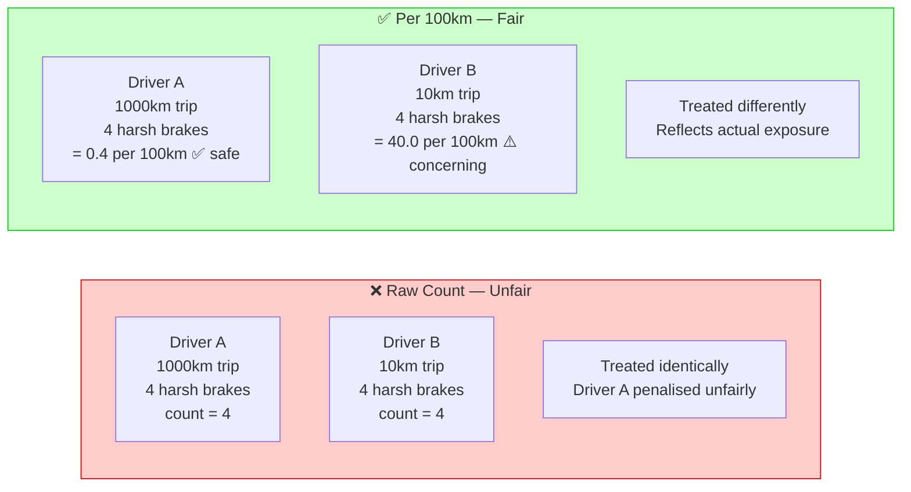

---

## 6. Scoring Logic

### Reward Model vs Penalty Model

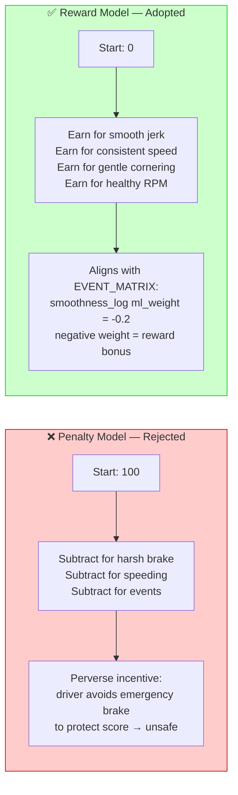

### Sprint 2 — Rule-Based Formula

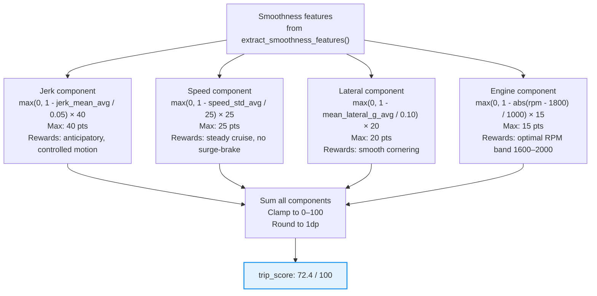

**Score label mapping:**

| Score  | Label         | Interpretation                              |
| ------ | ------------- | ------------------------------------------- |
| 85–100 | Excellent     | Consistently smooth — top-tier behaviour    |
| 70–84  | Good          | Above average, minor variations             |
| 55–69  | Average       | Acceptable, room to improve                 |
| 40–54  | Below Average | Noticeable roughness — coaching recommended |
| 0–39   | Poor          | Significant issues — priority coaching      |

### Sprint 3 — XGBoost Model

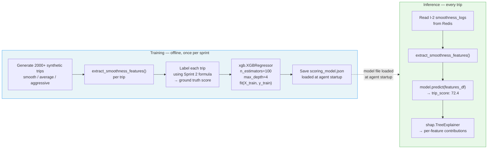

---

## 7. Coaching Flag Logic

### Threshold Evaluation

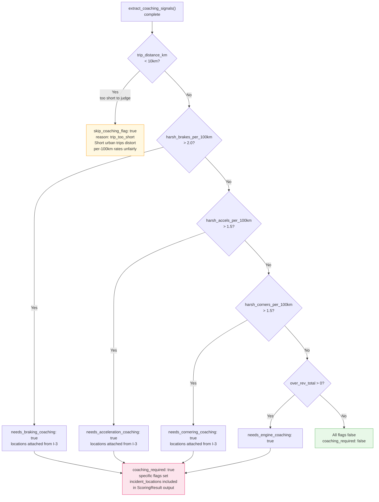

### Three Orchestrator Rules

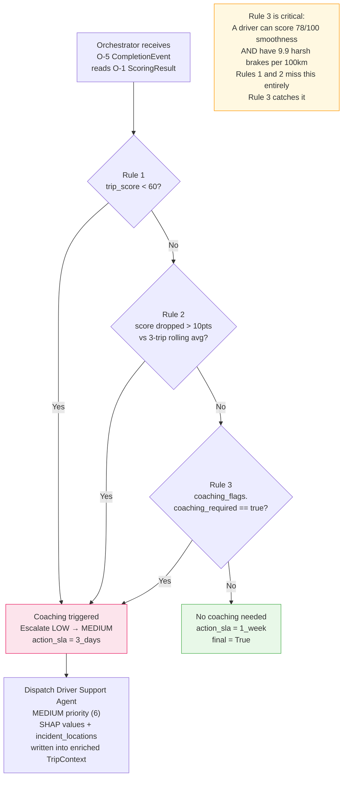

---

## 8. SHAP and Fairness

### SHAP — Turning the Score Into an Explanation

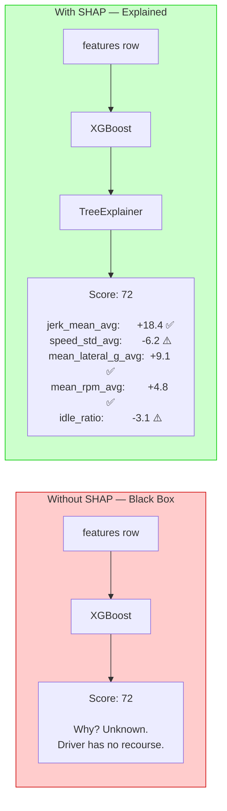

### SHAP + Location → Specific Coaching

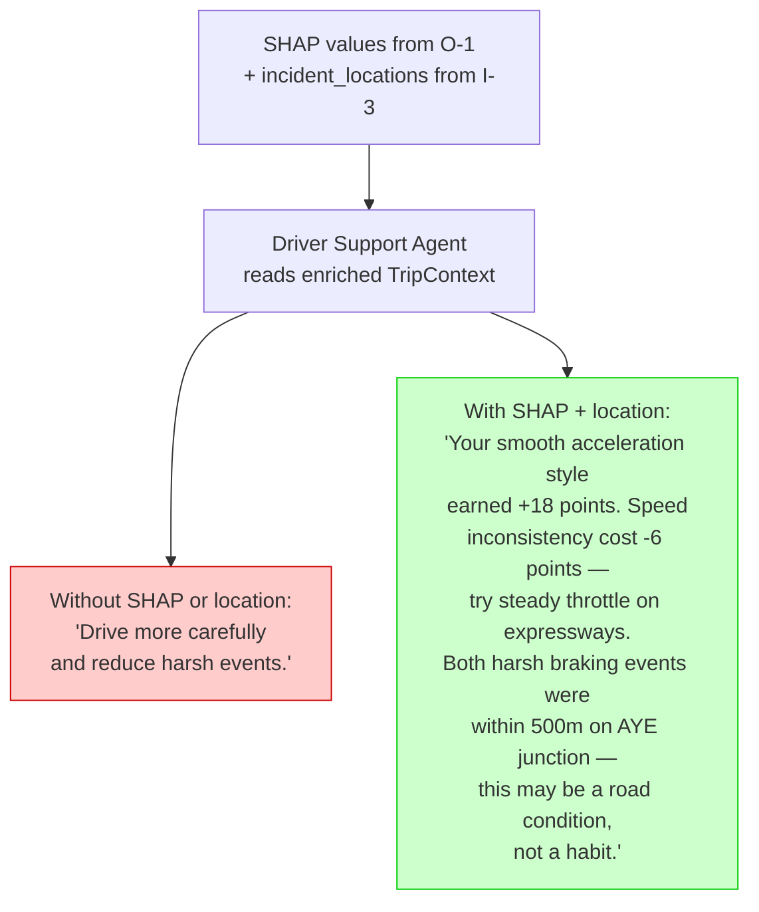

### Fairness — Two-Layer Defence

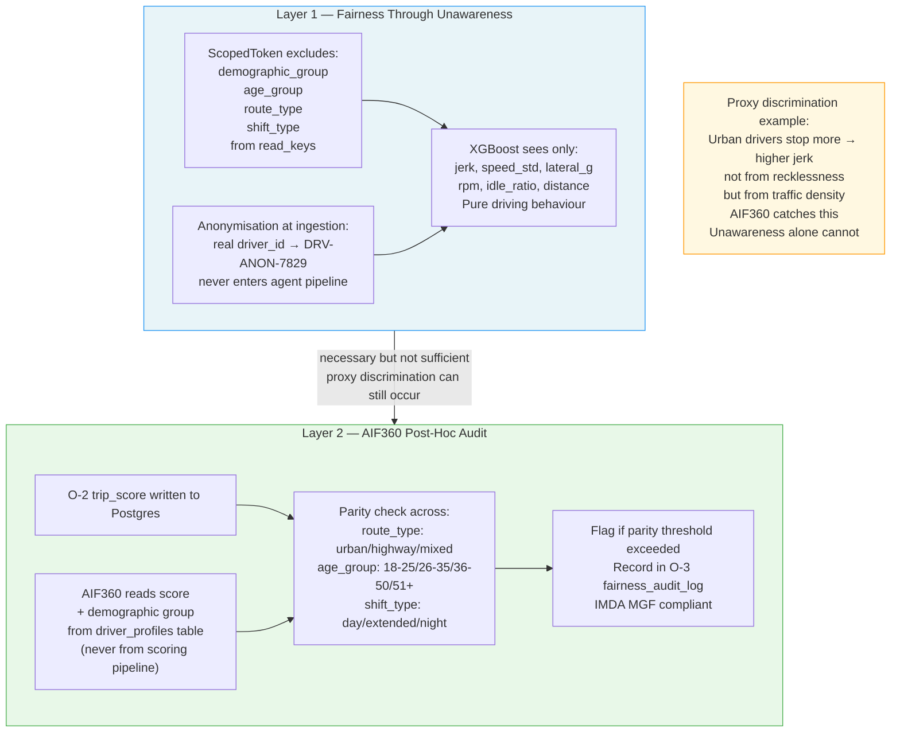

---

## 9. Output Detail

### O-1 — ScoringResult (Redis)

**Redis Key:** `trip:{trip_id}:scoring_output`  
**Type:** String (JSON)  
**TTL:** 3600 seconds  
**Written by:** Scoring Agent  
**Read by:** Orchestrator (coaching rule evaluation), Driver Support Agent (via enriched TripContext)

```json
{
  "trip_id": "TRIP-T12345-2026-03-07-08:00",
  "agent": "scoring",
  "scored_at": "2026-03-07T09:08:41Z",

  "trip_score": 72.4,
  "score_label": "Good",
  "peer_group_avg": 68.4,
  "historical_avg": 71.2,
  "delta_from_avg": +1.2,

  "score_breakdown": {
    "jerk_component": 28.4,
    "speed_component": 18.2,
    "lateral_component": 16.8,
    "engine_component": 9.0
  },

  "extracted_features": {
    "jerk_mean_avg": 0.014,
    "jerk_max_peak": 0.089,
    "speed_std_avg": 12.2,
    "mean_lateral_g_avg": 0.027,
    "max_lateral_g_peak": 0.22,
    "mean_rpm_avg": 1677,
    "idle_ratio": 0.077,
    "trip_distance_km": 40.3
  },

  "shap_values": {},
  "shap_explanation": "",

  "coaching_flags": {
    "coaching_required": true,
    "needs_braking_coaching": true,
    "needs_acceleration_coaching": false,
    "needs_cornering_coaching": true,
    "needs_engine_coaching": false,
    "rates_per_100km": {
      "harsh_brakes": 9.93,
      "harsh_accels": 2.48,
      "harsh_corners": 2.48
    },
    "raw_counts": {
      "harsh_brakes": 4,
      "harsh_accels": 1,
      "harsh_corners": 1,
      "over_revs": 0
    },
    "incident_locations": [
      {
        "event_id": "EV-T12345-00040",
        "event_type": "harsh_brake",
        "lat": 1.3621,
        "lon": 103.982,
        "trip_meter_km": 4.1,
        "peak_force_g": -0.52
      },
      {
        "event_id": "EV-T12345-00041",
        "event_type": "harsh_brake",
        "lat": 1.3189,
        "lon": 103.7808,
        "trip_meter_km": 33.2,
        "peak_force_g": -0.48
      },
      {
        "event_id": "EV-T12345-00042",
        "event_type": "harsh_brake",
        "lat": 1.3298,
        "lon": 103.8234,
        "trip_meter_km": 28.7,
        "peak_force_g": -0.71
      },
      {
        "event_id": "EV-T12345-00043",
        "event_type": "harsh_brake",
        "lat": 1.3301,
        "lon": 103.8229,
        "trip_meter_km": 29.1,
        "peak_force_g": -0.64
      }
    ],
    "trip_distance_km": 40.3
  },

  "fairness_flags": {
    "below_peer_avg": false,
    "significant_delta": false,
    "audit_required": false
  }
}
```

### O-2 — trip_scores (Postgres)

```sql
INSERT INTO trip_scores (
  trip_id,
  driver_id,              -- anonymised token
  truck_id,
  trip_score,
  score_label,
  peer_group_avg,
  historical_avg,
  delta_from_avg,
  score_breakdown,        -- JSONB
  extracted_features,     -- JSONB
  shap_values,            -- JSONB (empty Sprint 2, populated Sprint 3)
  shap_explanation,       -- TEXT
  lime_explanation,       -- TEXT (NULL unless dispute)
  coaching_flags,         -- JSONB
  fairness_flags,         -- JSONB
  scored_at
)
```

### O-3 — fairness_audit_log (Postgres)

```sql
INSERT INTO fairness_audit_log (
  driver_id,              -- anonymised
  trip_id,
  demographic_group,      -- read from driver_profiles, NEVER from scoring pipeline
  trip_score,
  peer_group_avg,
  delta,
  demographic_parity_flag,
  disparate_impact_ratio,
  imda_compliant,
  audit_timestamp
)
```

### O-4 — driver_scores (Postgres)

```sql
INSERT INTO driver_scores (driver_id, driver_rating, trips_counted, computed_at)
ON CONFLICT (driver_id)
DO UPDATE SET
  driver_rating  = EXCLUDED.driver_rating,
  trips_counted  = EXCLUDED.trips_counted,
  computed_at    = EXCLUDED.computed_at;

-- driver_rating = round((avg_of_last_20_scores / 100) * 5, 1)
-- e.g. avg 72.4 → rating 3.6 ⭐⭐⭐
-- minimum 3 trips required before rating is shown to driver
```

### O-5 — CompletionEvent (Redis Pub/Sub + durable list)

```json
{
  "trip_id": "TRIP-T12345-2026-03-07-08:00",
  "agent": "scoring",
  "status": "done",
  "priority": 6,
  "action_sla": "3_days",
  "escalated": true,
  "final": false
}
```

`escalated: true` signals the Orchestrator that the agent raised priority from LOW (9) to MEDIUM (6) based on coaching rules. `final: false` signals that the Driver Support Agent still needs to run.

### What the Driver Sees

```
╔══════════════════════════════════════════════════╗
║  Trip Complete                                   ║
║  Changi → Clementi  |  40.3 km  |  1h 02m        ║
╠══════════════════════════════════════════════════╣
║  Trip Score          72 / 100    ✅ Good          ║
║  Your Recent Avg     71.2                        ║
║  This Trip           +1.2 above your average     ║
╠══════════════════════════════════════════════════╣
║  Why you scored well:                            ║
║  ✅ Smooth acceleration rhythm       (+18 pts)   ║
║  ✅ Gentle cornering                  (+9 pts)   ║
║  ✅ Good engine RPM range             (+5 pts)   ║
║  ⚠️  Speed varied on expressway        (-6 pts)  ║
║  ⚠️  Minor idling at delivery bay      (-3 pts)  ║
╠══════════════════════════════════════════════════╣
║  Driver Rating       ⭐⭐⭐  3.6 / 5.0            ║
║  Based on last 8 trips                           ║
╚══════════════════════════════════════════════════╝
```

---

## 10. Worked Example — Changi to Clementi

**Trip:** 40.3 km | 62 minutes | 6 smoothness windows | Changi → PIE → AYE → Clementi

### Full Redis State — All 5 Keys

```mermaid
gantt
    title Redis Key Lifecycle — Changi to Clementi Trip
    dateFormat HH:mm
    axisFormat %H:%M

    section Device → Postgres (during trip)
    smoothness windows 0–5 ingested to Postgres     :done, 08:00, 09:02
    harsh events EV-00040 to 00043 → Postgres       :crit, 08:06, 08:46

    section Safety Agent (real-time, within 2 min of each event)
    EV-00040 enriched → safety_output               :crit, 08:06, 08:08
    EV-00042 enriched → safety_output               :crit, 08:34, 08:37
    EV-00043 enriched → safety_output               :crit, 08:35, 08:38
    EV-00041 enriched → safety_output               :crit, 08:44, 08:46
    All enrichment DONE (25 min before end_of_trip) :milestone, 08:46, 0d

    section Orchestrator (at trip end T=09:02)
    Cache warming: events + safety_output → Redis   :active, 09:02, 09:03

    section Redis key TTL windows
    KEY 1 telemetry buffer (consumed)               :done, 08:00, 09:03
    KEY 2 context (TTL 2h)                       :09:03, 11:03
    KEY 3 smoothness_logs (TTL 2h)               :09:03, 11:03
    KEY 4 harsh_events (TTL 2h)                  :09:03, 11:03
    KEY 5 scoring_output (TTL 1h)                :09:08, 10:08
    KEY 6 events channel (TTL 30m)               :09:08, 09:38
```

**KEY 1 — `telemetry:T12345:buffer` (ZSet, consumed during trip)**

```
Priority ZSet — device writes, Orchestrator drains via zpopmin

During trip:
  score=3 → harsh_brake EV-00040  08:06  → consumed immediately (HIGH)
  score=3 → harsh_brake EV-00042  08:34  → consumed immediately (HIGH)
  score=3 → harsh_brake EV-00043  08:35  → consumed immediately (HIGH)
  score=3 → harsh_brake EV-00041  08:44  → consumed immediately (HIGH)
  score=9 → smoothness_log win 0  08:10  → consumed quietly (LOW)
  score=9 → smoothness_log win 1  08:20  → consumed quietly (LOW)
  score=9 → smoothness_log win 2  08:30  → consumed quietly (LOW)
  score=9 → smoothness_log win 3  08:40  → consumed quietly (LOW)
  score=9 → smoothness_log win 4  08:50  → consumed quietly (LOW)
  score=9 → smoothness_log win 5  09:02  → consumed quietly (LOW)
  score=9 → end_of_trip           09:02  → triggers cache warming (LOW)

All members consumed by T=09:03. Key effectively empty.
```

**KEY 2 — `trip:TRIP-T12345-2026-03-07-08:00:context` (String JSON, TTL 2h)**

```json
{
  "trip_id": "TRIP-T12345-2026-03-07-08:00",
  "driver_id": "DRV-ANON-7829",
  "truck_id": "T12345",
  "priority": 9,
  "historical_avg_score": 71.2,
  "peer_group_avg": 68.4,
  "trip_summary": {
    "trip_start_time": "2026-03-07T08:00:00Z",
    "trip_end_time": "2026-03-07T09:02:14Z",
    "duration_minutes": 62,
    "distance_km": 40.3,
    "odometer_start_km": 180200.0,
    "odometer_end_km": 180240.3,
    "start_coords": { "lat": 1.3644, "lon": 103.9915 },
    "end_coords": { "lat": 1.3138, "lon": 103.764 },
    "window_count": 6
  }
}
```

**KEY 3 — `trip:TRIP-T12345-2026-03-07-08:00:smoothness_logs` (Redis List, 6 entries, TTL 2h)**

```
INDEX 0 — 08:00→08:10 | Changi urban | Trip: 0→5.2km
  coords:   start(1.3644,103.9915) → end(1.3489,103.9401)
  speed:    mean 38.4 kmh  std_dev 14.2  ← variable, traffic lights
  jerk:     mean 0.018  max 0.072        ← noticeable in urban traffic
  lateral:  mean_g 0.04  max_g 0.22
  engine:   rpm 1640  idle 85s           ← traffic light stops
  harsh:    brakes 1  accels 0  corners 0
  incident_event_ids: ["EV-T12345-00040"]
  raw_log_url: s3://tracedata-sensors/T12345-batch-001.bin

INDEX 1 — 08:10→08:20 | PIE expressway | Trip: 5.2→13.8km
  coords:   start(1.3489,103.9401) → end(1.3356,103.8812)
  speed:    mean 82.1 kmh  std_dev 6.8   ← very consistent cruise
  jerk:     mean 0.007  max 0.031        ← very smooth
  lateral:  mean_g 0.02  max_g 0.11
  engine:   rpm 1880  idle 0s
  harsh:    brakes 0  accels 0  corners 0
  incident_event_ids: []
  raw_log_url: s3://tracedata-sensors/T12345-batch-002.bin

INDEX 2 — 08:20→08:30 | PIE continues | Trip: 13.8→22.1km
  coords:   start(1.3356,103.8812) → end(1.3298,103.8234)
  speed:    mean 79.3 kmh  std_dev 9.1
  jerk:     mean 0.009  max 0.038
  lateral:  mean_g 0.02  max_g 0.14
  engine:   rpm 1820  idle 0s
  harsh:    brakes 0  accels 0  corners 0
  incident_event_ids: []
  raw_log_url: s3://tracedata-sensors/T12345-batch-003.bin

INDEX 3 — 08:30→08:40 | AYE congestion | Trip: 22.1→29.4km  ← worst window
  coords:   start(1.3298,103.8234) → end(1.3201,103.7912)
  speed:    mean 54.2 kmh  std_dev 18.6  ← high variance, stop-start
  jerk:     mean 0.024  max 0.089        ← roughest window
  lateral:  mean_g 0.03  max_g 0.19
  engine:   rpm 1720  idle 42s
  harsh:    brakes 2  accels 1  corners 0
  incident_event_ids: ["EV-T12345-00042", "EV-T12345-00043"]
  raw_log_url: s3://tracedata-sensors/T12345-batch-004.bin

INDEX 4 — 08:40→08:50 | Clementi approach | Trip: 29.4→35.8km
  coords:   start(1.3201,103.7912) → end(1.3162,103.7731)
  speed:    mean 41.2 kmh  std_dev 12.4
  jerk:     mean 0.016  max 0.061
  lateral:  mean_g 0.03  max_g 0.21
  engine:   rpm 1580  idle 58s
  harsh:    brakes 1  accels 0  corners 1
  incident_event_ids: ["EV-T12345-00041"]
  raw_log_url: s3://tracedata-sensors/T12345-batch-005.bin

INDEX 5 — 08:50→09:02 | Clementi final | Trip: 35.8→40.3km
  coords:   start(1.3162,103.7731) → end(1.3138,103.7640)
  sample_count:  734  window_seconds: 734  ← partial window, trip ended mid-interval
  speed:    mean 28.1 kmh  std_dev 11.8
  jerk:     mean 0.012  max 0.048
  lateral:  mean_g 0.02  max_g 0.16
  engine:   rpm 1420  idle 94s            ← waiting at delivery bay
  harsh:    brakes 0  accels 0  corners 0
  incident_event_ids: []
  raw_log_url: s3://tracedata-sensors/T12345-batch-006.bin
```

**KEY 4 — `trip:TRIP-T12345-2026-03-07-08:00:harsh_events` (Redis List, 4 entries, TTL 2h)**

Loaded by Orchestrator — merged from `events` table + `safety_output` table.

```
INDEX 0 — EV-T12345-00040
  event_type:        harsh_brake
  timestamp:         2026-03-07T08:06:14Z
  trip_meter:        4.1 km
  location:          lat 1.3621  lon 103.9820   ← Changi traffic light
  peak_decel:        -0.52g
  duration:          1.1s
  speed:             42.0 kmh at event
  safety_context:
    known_hazard_zone:   false
    peak_hour_traffic:   true
    recommended_action:  monitor
    safety_note:         "Urban traffic stop during morning peak. Expected behaviour."

INDEX 1 — EV-T12345-00041
  event_type:        harsh_brake
  timestamp:         2026-03-07T08:44:31Z
  trip_meter:        33.2 km
  location:          lat 1.3189  lon 103.7808   ← Clementi approach
  peak_decel:        -0.48g
  duration:          0.9s
  speed:             38.5 kmh at event
  safety_context:
    known_hazard_zone:   false
    peak_hour_traffic:   false
    recommended_action:  coach
    safety_note:         "No environmental factors. Braking habit worth reviewing."

INDEX 2 — EV-T12345-00042
  event_type:        harsh_brake
  timestamp:         2026-03-07T08:34:22Z
  trip_meter:        28.7 km
  location:          lat 1.3298  lon 103.8234   ← AYE-KM28 ┐ both at same
  peak_decel:        -0.71g  ← hardest brake of the trip    │ hazard zone
  duration:          1.4s                                    │
  speed:             67.2 kmh at event                      │
  safety_context:
    known_hazard_zone:        true                          │
    hazard_zone_name:         "AYE-KM28 merge point"        │
    hazard_zone_incidents_6m: 14                            │
    peak_hour_traffic:        true                          │
    recommended_action:       monitor                       │
    safety_note:              "Known hazard zone, peak hour.│Route condition not driver habit."

INDEX 3 — EV-T12345-00043
  event_type:        harsh_brake
  timestamp:         2026-03-07T08:35:47Z
  trip_meter:        29.1 km
  location:          lat 1.3301  lon 103.8229   ← AYE-KM28 ┘
  peak_decel:        -0.64g
  duration:          1.2s
  speed:             61.8 kmh at event
  safety_context:
    known_hazard_zone:        true
    hazard_zone_name:         "AYE-KM28 merge point"
    hazard_zone_incidents_6m: 14
    peak_hour_traffic:        true
    recommended_action:       monitor
    safety_note:              "Same hazard zone, 85 seconds after INDEX 2. Route condition."
```

**What the enrichment tells the Driver Support Agent:**

```
4 harsh brakes total. But they are NOT all the same:

  EV-00040: peak hour, urban stop. Normal for Changi traffic.
  EV-00041: no context factors. Actual habit worth coaching. ← actionable
  EV-00042: known hazard zone + peak hour. Route condition.
  EV-00043: same hazard zone 85s later. Route condition.

Coaching message is now surgical:
  "3 of your 4 braking events are explained by route conditions.
   EV-00041 near Clementi at low speed with no environmental factors
   is the one worth working on. Try increasing your following distance
   in residential areas."

Without enrichment: generic message, low driver trust
With enrichment:    specific message, high driver trust, actionable
```

**What the coordinates tell you:**

```
Window 0  08:00–08:10  Changi, urban       → slow, variable, 1 brake at traffic light
Window 1  08:10–08:20  PIE expressway      → smooth, consistent, zero events ← best window
Window 2  08:20–08:30  PIE continues       → smooth, consistent, zero events ← best window
Window 3  08:30–08:40  AYE, congestion     → roughest — 2 hard brakes, high jerk ← worst window
Window 4  08:40–08:50  Clementi approach   → urban again, 1 brake, 1 corner
Window 5  08:50–09:02  Clementi delivery   → slow, high idle at bay

GPS alone tells you WHERE the events happened.
Safety enrichment tells you WHY they happened.

Together:
  EV-00042, EV-00043  AYE-KM28 merge point  known hazard zone + peak hour → route condition
  EV-00040            Changi junction        peak hour urban stop           → normal traffic
  EV-00041            Clementi Ave 6         no hazard zone, no peak hour   → actual habit ← actionable

Coaching is now surgical:
  "3 of your 4 braking events are explained by route conditions.
   The one near Clementi Ave 6 at low speed with no environmental
   factors is the habit worth working on."
```

**KEY 5 — `trip:TRIP-T12345-2026-03-07-08:00:scoring_output` (String JSON, TTL 1h)**

Written by Scoring Agent at T=09:08. Full schema in Section 9 (O-1). Summary for this trip:

```
trip_score:    72.4 / 100  (Good)
delta:         +1.2 vs historical avg of 71.2

Feature contributions (Sprint 3 SHAP — illustrative):
  jerk_mean_avg:      +18.4  ← smooth acceleration earned most points
  mean_lateral_g_avg:  +9.1  ← gentle cornering
  mean_rpm_avg:        +4.8  ← good engine discipline
  speed_std_avg:       -6.2  ← variability on expressway cost points
  idle_ratio:          -3.1  ← delivery bay idle minor penalty

coaching_flags:
  coaching_required:        true
  needs_braking_coaching:   true   ← 4 brakes / 40.3km = 9.9 per 100km > 2.0
  needs_cornering_coaching: true   ← 1 corner / 40.3km = 2.5 per 100km > 1.5
  incident_locations: 4 entries — each includes:
    GPS coordinates
    peak_force_g
    safety_context:
      EV-00040: monitor  (peak hour, urban stop — normal)
      EV-00041: coach    ← the actionable one — no environmental factors
      EV-00042: monitor  (AYE-KM28 known hazard zone, peak hour)
      EV-00043: monitor  (same hazard zone 85s later)
```

**KEY 6 — `trip:TRIP-T12345-2026-03-07-08:00:events` (Pub/Sub + List, TTL 30m)**

```json
{
  "trip_id": "TRIP-T12345-2026-03-07-08:00",
  "agent": "scoring",
  "status": "done",
  "priority": 6,
  "action_sla": "3_days",
  "escalated": true,
  "final": false
}
```

---

## 11. Security — Intent Gate

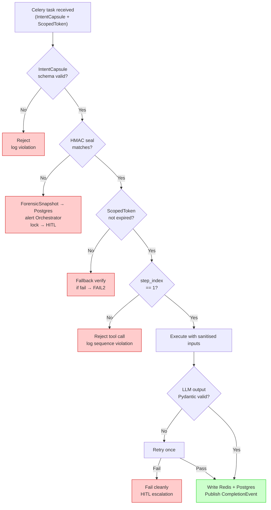

---

## 12. Sprint Plan

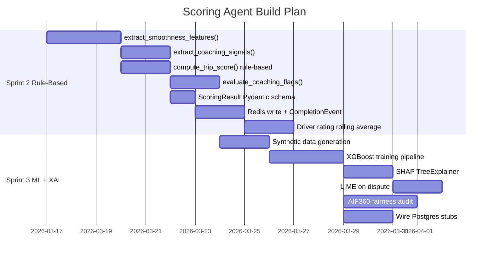

| Component             | Sprint 2                         | Sprint 3                        |
| --------------------- | -------------------------------- | ------------------------------- |
| Trip score            | Rule-based formula               | XGBoost model                   |
| SHAP values           | Empty dict `{}`                  | TreeExplainer output            |
| LIME                  | Not implemented                  | On dispute — S3 raw log fetched |
| AIF360                | `fairness_flags` hardcoded false | Full statistical parity         |
| Postgres writes       | TODO stubs                       | Fully wired                     |
| Harsh event locations | Fetched from Redis I-3           | Same                            |
| S3 raw log            | Not fetched                      | On dispute only                 |

---

## 13. Key Design Decisions

| Decision                                                                    | Rationale                                                                                     | Authority                  |
| --------------------------------------------------------------------------- | --------------------------------------------------------------------------------------------- | -------------------------- |
| Score = pure smoothness only                                                | Prevents perverse incentive to avoid emergency braking                                        | This document              |
| `smoothness_log` ml_weight = -0.2 (reward)                                  | EVENT_MATRIX encodes reward philosophy numerically                                            | A3 Input Data Architecture |
| Coaching flags from I-3 harsh event records, not smoothness_log count field | Richer data: GPS coords, force, duration — enables location-aware coaching                    | A3 Input Data Architecture |
| Safety Agent enrichment merged into I-3 at cache warming                    | Orchestrator is the only DB reader — agents never query Postgres; event_id is correlation key | This document              |
| Safety Agent `recommended_action` informs coaching but does not gate it     | Coaching flag raised on per-100km rate regardless; enrichment adds context not gating logic   | This document              |
| `safety_context: null` handled gracefully                                   | Rare edge case where Safety Agent is delayed must not block coaching output                   | This document              |
| `incident_event_ids` cross-reference                                        | Enables "both events at same junction" coaching insight                                       | A3 Input Data Architecture |
| Device computes edge statistics, not cloud                                  | Scoring formula tunable without OTA firmware update                                           | A3 Input Data Architecture |
| S3 for raw logs, Postgres for stats                                         | Classic data lake pattern — queryable index + raw archive                                     | A3 Input Data Architecture |
| Orchestrator loads Postgres → Redis                                         | Agents never hold DB credentials; single point of data access control                         | FL-SCO-01                  |
| end_of_trip contains lifecycle metadata only                                | Single source of truth = raw event rows, no pre-computed stats                                | This document              |
| Per-100km rate for coaching flags                                           | Distance normalisation = fairness for long-haul vs urban drivers                              | A3 Input Data Architecture |
| Min 10km trip for coaching flag                                             | Short trips cannot be fairly evaluated due to traffic density distortion                      | This document              |
| Demographic data never in TripContext                                       | Fairness Through Unawareness enforced at architecture level, not convention                   | FL-SCO-01                  |
| AIF360 runs post-scoring                                                    | Separates scoring logic from fairness audit — clean separation of concerns                    | FL-SCO-01                  |
| Partial last window handled by duration                                     | Last window may be < 600 seconds — use actual window_seconds, not assume 600                  | This document              |
