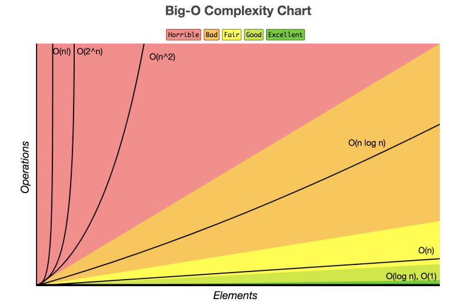

Big O notation is a mathematical notation that describes the upper bound or worst-case scenario for the time complexity of an algorithm

```bash
O(f(n))
```


Big O notation is a fundamental concept in computer science for analyzing how efficient algorithms are. It describes how the execution time or memory usage of an algorithm scales as the size of the input grows. 

##### Understanding Big O
Imagine you have an algorithm that sorts a list of numbers. As the number of numbers in the list (input size) increases, how long does it take the algorithm to run (execution time)? Big O notation helps categorize this relationship between input size and performance.

##### Common Big O Notations
###### O(1) - Constant Time 
This is the best case scenario. The algorithm's execution time remains constant regardless of the input size. An example is accessing a single element in an array by its index.
```python
def access_element(arr, index):
    return arr[index]

# Example usage
my_array = [1, 2, 3, 4, 5]
print(access_element(my_array, 2))  # Output: 3
```
###### O(log n) - Logarithmic Time
The execution time grows logarithmically with the input size. This means the time increases slowly even for massive inputs. Searching a sorted list using binary search is an example.

```python
import bisect

def binary_search(arr, target):
    index = bisect.bisect_left(arr, target)
    if index != len(arr) and arr[index] == target:
        return index
    return -1

# Example usage
my_list = [1, 3, 5, 7, 9, 11, 13, 15]
print(binary_search(my_list, 9))  # Output: 4
```

###### O(n) - Linear Time
The execution time increases directly proportional to the input size. It means it takes twice as long for twice the input. Iterating through a list once is an example of O(n).

```python
def linear_search(arr, target):
    for i, num in enumerate(arr):
        if num == target:
            return i
    return -1

# Example usage
my_list = [4, 7, 2, 9, 1, 6]
print(linear_search(my_list, 2))  # Output: 2
```

###### O(n log n) - Log Linear Time
This falls between linear and logarithmic. Sorting algorithms like Merge Sort or Quicksort have this complexity.

###### O(n^2) - Quadratic Time
The execution time increases quadratically with the input size. Doubling the input size leads to four times the execution time. Nested loops iterating over the entire input are a common culprit for O(n^2).

```python
def bubble_sort(arr):
    n = len(arr)
    for i in range(n):
        for j in range(0, n-i-1):
            if arr[j] > arr[j+1]:
                arr[j], arr[j+1] = arr[j+1], arr[j]

# Example usage
my_list = [64, 34, 25, 12, 22, 11, 90]
bubble_sort(my_list)
print(my_list)  # Output: [11, 12, 22, 25, 34, 64, 90]

```
##### Example: Linear Search vs. Binary Search

Let's compare two search algorithms:
1. **Linear Search:** This algorithm iterates through each element in the list one by one until it finds the target element. As the list size grows (n), the number of comparisons (and execution time) also grows linearly (O(n)).
2. **Binary Search:** This algorithm works only on sorted lists. It repeatedly divides the search space in half until it finds the target element. The number of comparisons grows logarithmically with the list size (O(log n)).

In simpler terms, for a large list, binary search will be much faster than linear search because its time complexity grows slower.
##### Why Big O Matters?
Big O notation helps choose algorithms for specific tasks. If you need to search a massive dataset frequently, a logarithmic time algorithm like binary search would be ideal compared to a linear search. It helps programmers understand the trade-offs between different approaches and optimize code for performance.
##### Beyond Big O
Big O notation focuses on the upper bound of complexity. There are other notations like Omega (Ω) for lower bound and Theta (Θ) for exact bound, but Big O is the most commonly used for initial analysis.
#### References
1. [[books/python/10_Data Structures and Algorithms Python.pdf#page=145&selection=112,1,113,21|10_Data Structures and Algorithms Python, page 145]]
2. Visual Big O Cheat Sheet: [https://www.freecodecamp.org/news/tag/big-o-notation/](https://www.freecodecamp.org/news/tag/big-o-notation/)
3. Big O Notation Explained: [https://www.freecodecamp.org/news/tag/big-o-notation/](https://www.freecodecamp.org/news/tag/big-o-notation/)