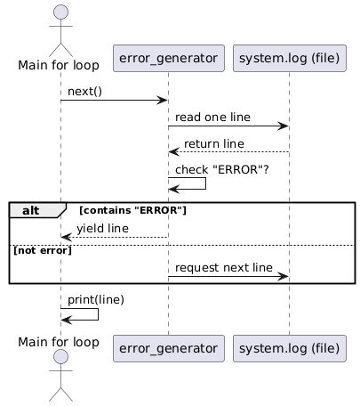
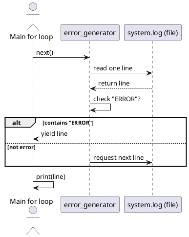

# Generators and Iterators

## Demonstrating Generators vs Naive Loops in Python

This experiment shows the practical difference between using a naive loop with lists and using generators when processing a large file.

## Setup

We created a `system.log` file with over 1 million lines of mixed entries:

```

INFO: System started
ERROR: Disk full
WARNING: CPU usage high
INFO: User login
ERROR: Network unreachable
...

```

The goal is to extract and print all `ERROR` lines.

## Approach 1: Naive (List Building)

```python
def get_errors_list(filename):
    errors = []
    with open(filename) as f:
        for line in f:
            if "ERROR" in line:
                errors.append(line.strip().upper())
    return errors

errors = get_errors_list("system.log")
for e in errors:
    print(e)
```

- Reads the file line by line.
- Stores all error lines into a list.
- Returns the list, requiring memory proportional to number of errors.

## Approach 2: Generator (Lazy Evaluation)

```python
def error_generator(filename):
    with open(filename) as f:
        for line in f:
            if "ERROR" in line:
                yield line.strip().upper()

for e in error_generator("system.log"):
    print(e)
```

- Reads one line at a time.
- Yields immediately if `"ERROR"` is found.
- Keeps memory usage constant, regardless of file size.

## How the Flow Works

- The outer `for` loop drives everything by repeatedly calling `next()` on the generator.
- `error_generator` then requests the next line from the file.
- If `"ERROR"` is found, it yields the line back to the loop immediately.
- Nothing is loaded into memory until the loop explicitly asks for the next line.

This pull-based control flow is why generators are said to be "lazy".

**Flow Diagram**



## Flow Diagram Source (PlantUML)



## Note on File Iteration

File objects in Python are themselves iterators:

```python
with open("system.log") as f:
    for line in f:
        print(line.strip())
```

This already works lazily, one line at a time.
Wrapping this in a generator (as we did with `error_generator`) is useful when you want to compose **pipelines** (e.g., filter, transform, combine steps) in a reusable way.

## Benchmark Results

Tested on a `system.log` file with 1,000,000+ lines:

| Version      | Errors Found | Time (s) | Memory (MB) |
| ------------ | ------------ | -------- | ----------- |
| List (naive) | 333,008      | \~0.74   | \~22.5      |
| Generator    | 333,008      | \~0.69   | \~0.03      |

## Insights

- Time: Similar, sometimes generators are faster since no list append operations.
- Memory: Generators are far more efficient, one line at a time instead of storing everything.
- Scalability:

  - List approach breaks down on very large files.
  - Generator approach works even with infinite streams (such as live server logs).

## Key Takeaway

- Use generators for large or streaming datasets.
- Use lists only when you truly need random access or repeated iteration over stored results.

Generators are like streaming episodes online. Lists are like downloading all episodes before watching.
